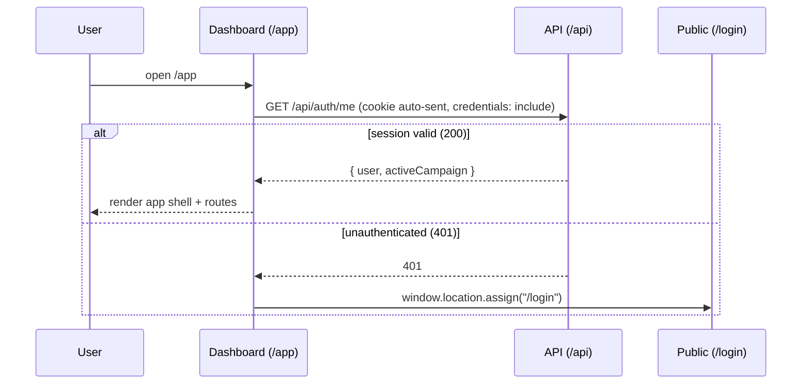

# Auth guard & session

The dashboard is an authenticated-only SPA. It never renders login/signup forms
— those live on the public app. Instead it gates everything behind a session
check and redirects unauthenticated visitors back to the public `/login`.

## Flow

## Pieces

- **`@rpg/api-client`** — shared same-origin fetch helpers used by both apps:
  - `fetchSession()` → `GET /api/auth/me`, returns `AuthMeResponse` or throws
    `ApiError` (401 when unauthenticated).
  - `logout()` → fetches a CSRF token from `GET /api/auth/csrf`, then
    `POST /api/auth/logout` with the `x-csrf-token` header.
  - `request`, `postJson`, etc. for other API calls.
- **`api/auth-client.ts`** — thin dashboard wrappers and path constants; re-exports
  from `@rpg/api-client` where shared.
- **`hooks/use-session.ts`** — `useSession()` wraps `fetchSession` in a
  TanStack Query (`["auth", "session"]`, `retry: false`) so a 401 surfaces
  immediately instead of being retried. Query data is `AuthMeResponse`; use
  `data?.user` at call sites.
- **`hooks/use-logout.ts`** — `useLogout()` mutation; on success redirects to
  `CROSS_APP_PATHS.login`.
- **`components/auth-guard.tsx`** — layout route element. Loading → spinner
  text; error → redirect to `/login`; success → `<Outlet />`.

Cross-app paths (`/login`, `/app/`, etc.) are defined in `CROSS_APP_PATHS` from
`@rpg/contracts` — import those instead of string literals.

## Why a hard redirect (not a React Router navigation)

`/login` is owned by the **public** app, a different SPA/origin path served by
the proxy. React Router only controls routes under the dashboard's `/app`
basename, so leaving the dashboard requires a real browser navigation
(`window.location.assign`). The same applies to logout.

## CSRF

State-changing requests (logout) use the double-submit pattern shared with the
public app: fetch a token from `GET /api/auth/csrf` (which also sets the
readable `rpg_csrf` cookie) and echo it in the `x-csrf-token` header. `GET`
requests like `/auth/me` are safe methods and need no token.

## Active campaign on `/me`

The API resolves `activeCampaign` server-side (including lazy-clear of a stale
`lastSelectedCampaignId`). Dashboard hooks that change campaign selection should
`invalidateQueries` on the session key so `activeCampaign` stays in sync — see
`use-select-campaign.ts`.
