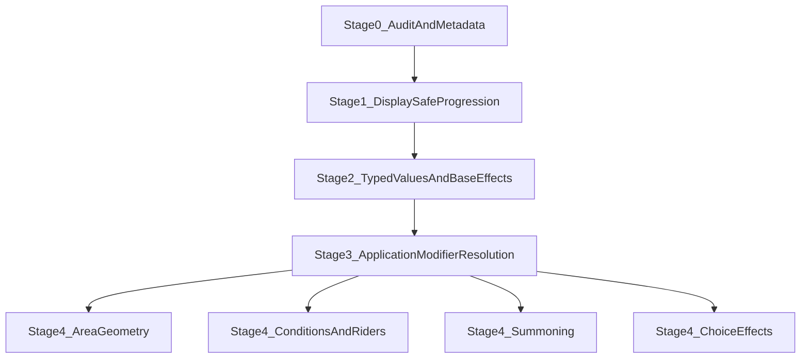

# Spell progression modeling — audit and staged schema roadmap

Analysis only. No schema or code changes are proposed for immediate implementation;
this document records catalog evidence, recommended vocabularies, exploratory schema
shapes, a staged roadmap, and open decisions.

**Operational inventory:** per-spell modeling status, gaps, and review state live in
the generated report [`spell-modeling-inventory.generated.md`](spell-modeling-inventory.generated.md)
(regenerated from catalog seeds in CI). Workflow and promotion criteria:
[`packages/catalog/docs/spell-modeling.md`](../../packages/catalog/docs/spell-modeling.md).

Date: 2026-07-13. Catalog snapshot: `packages/catalog/src/spells/data/srd-cc-5.2.1/`
(92 spells: 20 cantrips, 33 L1, 8 L2, 8 L3, 4 L4, 8 L5, 3 L6, 3 L7, 1 L8, 4 L9).

---

## 1. Executive assessment

**Catalog maturity.** The spell content type is deliberately prose-first
(`packages/contracts/src/rpg/content/spell.ts`): structured metadata exists for
school, level, classes, casting time, range, duration, components, delivery method,
and tags, while every mechanical fact — damage dice, healing, save abilities, scaling —
lives in TipTap HTML (`description`, `cantripScaling`, `higherLevelSlotEffect`).
Nothing in the repo currently models a spell effect, a damage roll on a spell, or a
progression of either. The catalog now covers all ten levels (levels 2–9 hold 39
spells), and the July 2026 seed batch deliberately added the outlier families the
first audit flagged as absent: summoning and stat-block references (Animate Dead,
Animate Objects, Summon Dragon, Planar Binding, Simulacrum), triggered/contingent
effects (Glyph of Warding, Symbol, Contingency), repeating zone damage (Wall of
Fire, Symbol, Delayed Blast Fireball), transformation (Polymorph, True Polymorph,
Magic Jar), and open-ended adjudication (Wish). Fireball and Burning Hands are
seeded with structured `areaOfEffect` geometry (dimensions only — origin not
modeled). Vocabulary derived today is still a floor, not a ceiling, but the floor
now includes the stress cases.

**Is a shared progression model justified?** Yes, and the outliers strengthen the
case. 41 of 92 spells scale; the top five families (slot damage dice, duration
tiers, cantrip damage dice, slot target count, slot healing dice) cover 29 of the
41, and the remainder is a long tail of custom rules that the prose-fallback track
absorbs. Two new spells validate the multi-track container design directly: Arcane
Hand scales two different effects at different rates (+2d8 fist, +2d6 crush per
slot), and Glyph of Warding scales its rune damage and its stored-spell level cap
independently. Cantrip scaling and slot scaling share the same conceptual shape — a base
effect plus a basis plus entries — and the repo already repeats a sparse
`{ level, value }` breakpoint pattern in four places (`classResourceSchema`,
`cantripsKnownEntrySchema`, `spellsAvailableEntrySchema`, plus the runtime
`progressionValueAtLevel` fill-forward helper). A shared container is warranted;
a universal effect engine is not.

**One structural correction to the proposed shape.** The suggested
`SpellProgressionTrack.entries: { threshold, value }[]` fits cantrips exactly
(levels 5/11/17, fill-forward). It does **not** fit most slot scaling: 24 of the 33
higher-slot effects are _linear rates_ ("increases by 1d10 for each spell slot level
above 1"), where materializing 8 threshold rows per spell would be authoring noise
and a maintenance trap. Duration-tier spells (Hex, Hunter's Mark, Mass Suggestion,
Bestow Curse, Planar Binding) are genuinely threshold-shaped on the slot basis. The
recommended track shape is therefore a discriminated union: `thresholds` (resolved
values at each threshold) or `linear` (base + increment per step above the spell's
level), both resolving to the same display output. Bestow Curse is the new hard case
for `thresholds`: its tiers change duration _and_ drop the concentration requirement
at slot 5+ — a value-plus-rider change that needs the entry-level `note`/`summary`
fields, not just a typed value.

**How far to go now.** Stages 0–2 (audit metadata, display-safe progression
container, typed values for the common families) are justified by current evidence
and unlock formatted rendering plus current/next-threshold resolution for the ~30
conventionally scaling spells; roughly 8 of the 41 scaling spells have progressions
that stay on the custom/prose track indefinitely (Summon Dragon's stat-block level,
Wish-class adjudication, Animate Objects' size-dependent damage). Stage 3
(application semantics, modifier source, save-based resolution structure) is
justified narrowly — 3 healing spells need `spellcasting-ability`, Arcane Hand adds
a fourth modifier case on damage, 3 spells need per-hit/per-projectile semantics —
and should be scoped to exactly that. Stage 4 families now have real catalog
evidence (5 summoning spells, 3 triggered glyphs, 3 repeating zones) but each is a
small population of high-complexity spells; they remain catalog-driven, not
scheduled.

**Major risks.**

1. **Premature universal effect schema.** 51 of 92 spells have no progression, and
   the new high-level outliers (Wish, Magic Jar, Prismatic Wall, True Polymorph,
   Antimagic Field) are precisely the spells whose behavior no reasonable schema
   should chase — alongside the choice-menu cantrips (Prestidigitation, Druidcraft,
   Thaumaturgy). Prose must stay first-class; the outliers are the strongest argument
   for the `prose-only` / `sufficient-for-display` ceiling being a legitimate terminal
   state, not a TODO.
2. **Patch/homebrew round-tripping.** Overlay patches deep-merge objects but replace
   arrays wholesale (`apps/api/src/features/content/lib/deep-merge.ts`); a structured
   `effects[]` array in a patch replaces the whole array. Acceptable, but validation
   must check effect-id references against the _merged_ body. There is no patch
   versioning; new fields must be additive and optional.
3. **Existing bug (pre-existing, Stage 0 candidate):** `HomebrewSpellModel` and
   `toHomebrewSpell` (`apps/api/src/features/content/spells/`) do not persist or map
   `cantripScaling` / `higherLevelSlotEffect` — homebrew spells silently drop scaling
   prose today. (Verify `areaOfEffect` reached the homebrew model when it was added;
   the same parity gap pattern applies to every new body field.)
4. **Cross-content references.** The summoning family (Animate Dead, Animate
   Objects, Summon Dragon, Simulacrum) references monster stat blocks that the
   creature content type does not fully model yet (`creatureStatBlockHitPointsSchema`
   formula is an opaque string). A structured summoning effect is blocked on creature
   modeling, not on spell schema work — capture this as a cross-domain dependency,
   not a spell-schema gap.
5. **Scaling-that-isn't-a-value.** Several new upcast rules mutate things other than
   an effect value: Dispel Magic raises its auto-success threshold, Glyph of Warding
   raises the stored-spell level cap, Summon Dragon feeds the slot level into a stat
   block, Bestow Curse removes its own concentration requirement. The linear/threshold
   tracks must not be stretched to fake these; they belong on the custom/prose track
   with gap codes.

---

## 2. Catalog classification (all 92 spells)

> **Moved.** Hand-maintained per-spell tables were removed to prevent doc/code drift.
> Use the generated inventory and manifest as operational sources of truth:
>
> - **Inventory (CI-generated):** [`docs/analysis/spell-modeling-inventory.generated.md`](spell-modeling-inventory.generated.md)
> - **Reviewed metadata source:** [`packages/catalog/src/spells/spell-modeling-manifest.ts`](../../packages/catalog/src/spells/spell-modeling-manifest.ts)
> - **Workflow:** [`packages/catalog/docs/spell-modeling.md`](../../packages/catalog/docs/spell-modeling.md)
>
> Status abbreviations used elsewhere in this doc (definitions in §11): **PO** prose-only,
> **MP** meaningful-partial (editor-eligible), **SD** sufficient-for-display, **SCS**
> sufficient-for-character-sheet, **MR** mechanics-ready. Legacy **PM** (partially-modeled)
> maps to **MP** in the new ladder.

---

## 3. Pattern frequency

41 scaling spells (8 cantrip-basis, 33 slot-basis) across 14 families:

| Family                                                      | Basis | Count | Spells                                                                                                                                                                                                        |
| ----------------------------------------------------------- | ----- | ----- | ------------------------------------------------------------------------------------------------------------------------------------------------------------------------------------------------------------- |
| Cantrip damage dice (5/11/17 thresholds)                    | char  | 5     | acid-splash, chill-touch, fire-bolt, poison-spray, sacred-flame                                                                                                                                               |
| Cantrip extra-damage dice (appears at 5)                    | char  | 1     | true-strike                                                                                                                                                                                                   |
| Cantrip projectile count                                    | char  | 1     | eldritch-blast                                                                                                                                                                                                |
| Cantrip range scaling                                       | char  | 1     | spare-the-dying                                                                                                                                                                                               |
| Slot: +N damage dice per slot (linear)                      | slot  | 12    | hellish-rebuke, inflict-wounds, ray-of-sickness, thunderwave, ice-knife (secondary), burning-hands, fireball, dragons-breath, wall-of-fire, glyph-of-warding, arcane-hand (×2 tracks), delayed-blast-fireball |
| Slot: +N healing dice per slot (linear, + ability mod base) | slot  | 3     | cure-wounds, mass-healing-word, mass-cure-wounds                                                                                                                                                              |
| Slot: +1 target per slot (linear)                           | slot  | 4     | bless, hideous-laughter, jump, longstrider                                                                                                                                                                    |
| Slot: +1 projectile per slot (linear)                       | slot  | 1     | magic-missile                                                                                                                                                                                                 |
| Slot: +N creatures per slot (linear)                        | slot  | 1     | animate-dead (+2 undead)                                                                                                                                                                                      |
| Slot: flat numeric per slot (linear)                        | slot  | 2     | false-life (+5 temp HP), aid (+5 HP)                                                                                                                                                                          |
| Slot: area-size per slot (linear)                           | slot  | 1     | fog-cloud (+20 ft radius)                                                                                                                                                                                     |
| Slot: duration tiers (irregular thresholds)                 | slot  | 5     | hex, hunters-mark, mass-suggestion, bestow-curse, planar-binding                                                                                                                                              |
| Slot: rule-threshold scaling (custom)                       | slot  | 2     | dispel-magic (auto-dispel cap), glyph-of-warding (stored-spell cap — its second track)                                                                                                                        |
| Slot: custom prose                                          | slot  | 3     | create-or-destroy-water (quantity choice), summon-dragon (stat-block input), animate-objects (size-dependent increment)                                                                                       |

Observations:

- Linear slot rates still dominate slot scaling (24 of 33 spells have at least one
  linear track). Threshold-shaped slot scaling remains exclusively duration tiers
  (now 5 spells).
- Every cantrip progression uses total character level with thresholds 5/11/17 —
  matching the fill-forward semantics already implemented for class resources.
- Multi-track progressions now have direct evidence: arcane-hand scales two damage
  effects at different rates (+2d8 / +2d6), and glyph-of-warding pairs a linear
  damage track with a custom rule-threshold track. The `tracks[]` array is no longer
  speculative.
- A new pattern the container must _refuse_ to absorb: scaling that mutates a rule
  rather than an effect value (dispel-magic's auto-success cap, glyph-of-warding's
  stored-spell cap, summon-dragon's stat-block input, bestow-curse dropping its own
  concentration requirement). These stay on custom/summary tracks.
- delayed-blast-fireball has a second progression on an _elapsed-turns_ basis
  (+1d6 per turn held) — the only non-level, non-slot basis in the catalog. Not
  worth a basis enum value for one spell; custom track.
- Spells that break the "override a base value" principle: true-strike introduces an
  effect with no base value; ice-knife and glyph-of-warding scale one effect while
  another is static; arcane-hand scales two of four modes.
- Spellcasting-ability now appears as an _input to counts and distances_
  (animate-objects' object count, arcane-hand's push distance), not just a roll
  modifier. Still no class-level or proficiency-bonus progression basis.

---

## 4. Recommended classification vocabularies

Legend: **now** = implement in the stage indicated; **reserve** = name it in the
roadmap doc and design unions to accommodate it, but do not implement; **defer** =
no evidence, revisit when catalog demands it.

### A. Progression basis

- Now (S1): `character-level`, `spell-slot-level`.
- Reserve: `class-level` (no current spell; plausible for homebrew — design the
  basis as a discriminated union so `{ kind: 'class-level', classId }` can be added).
- Defer: `spellcasting-ability`, `proficiency-bonus`, `custom` (custom is subsumed by
  the prose-fallback track, which is safer than an open basis).

### B. Progression target

- Now (S2): `primary-damage`, `extra-damage`, `healing`, `temporary-hit-points`,
  `projectile-count`, `target-count`, `range`, `area-size`, `duration`, `custom`
  (custom = summary/prose entries only).
- Reserve: `hit-point-maximum` (aid), `effect-count`, `creature-count` (promoted
  from defer — animate-dead's "+2 undead per slot" is a clean linear count that is
  neither targets nor projectiles; one spell doesn't justify implementing it, but
  the union should anticipate it).
- Defer: `attack-count`, `beam-count`, `resource-count`, `summoned-stat` (evidence
  now exists — summon-dragon, animate-objects — but both are blocked on stat-block
  modeling and stay custom), `choice-count`.
- Explicitly not a target: rule-threshold scaling (dispel-magic, glyph-of-warding's
  spell cap). These are `custom` by design; inventing a `rule-threshold` target
  would invite modeling arbitrary rules text as key-value pairs.

Distinctions worth keeping separate:

- **primary vs extra damage** — extra damage rides another resolution (true-strike
  rides a weapon attack; hex/hunter's-mark ride any hit) and must never be summed
  into a single displayed roll with the carrier's damage.
- **projectile-count vs target-count** — projectiles multiply a damage instance
  (eldritch-blast, magic-missile) and interact with application semantics;
  target-count only widens who receives one instance (bless, jump). Collapsing them
  invites the "3d10" aggregation error. `beam-count`/`dart-count` fold into
  `projectile-count`; resolution method (attack vs automatic) stays orthogonal.
- **range vs area-size** — range is the existing structured `spellRangeSchema` field
  (spare-the-dying overrides it); area-size has a structured geometry home in
  `areaOfEffect` (fog-cloud, fireball, burning-hands) but radius scaling and origin
  semantics remain prose-only until `area-origin-model-missing` is addressed.
- **duration vs repeated-effect count** — duration tiers change `spellDurationSchema`
  values; nothing in the catalog scales a number of repetitions. Keep only duration.

### C. Value shape

- Now (S2), reusing existing primitives:
  - `roll` — `{ dice?: Dice (reuse diceSchema { count, faces }), flat?: int }`
    covers 1d10, 2d4+4, 1d4+1, and flat +5.
  - `count` — positive int.
  - `distance` — reuse `distanceSchema { value, unit: 'ft' }`.
  - `duration` — reuse the `timed` variant of `spellDurationSchema`.
  - `text` — summary string (custom tracks).
- Recommendation on Damage/Healing: **semantic effect kinds wrapping a shared
  `roll`**, not distinct value shapes. `SpellEffect` of kind `damage` carries
  `{ roll, damageType: DamageTypeId }`; kind `healing` carries `{ roll }`. The
  progression track then overrides the `roll`. This mirrors the existing
  `weaponDamageSchema` split (roll shape vs damage type) and avoids a parallel
  `DamageValue`/`HealingValue` pair that duplicates `roll`.
- Note: `dieFaceSchema` (d4–d100) already covers every die in the catalog. Do not
  introduce a dice-expression string parser; the structured `roll` object is enough
  and matches the constraint against runtime prose inference.

### D. Application

- Now (S3): `once`, `per-hit`, `per-projectile`. Default `once` when absent.
- Reserve: `per-target` (only needed if display ever aggregates across targets —
  today "once" per recipient is implied by target semantics); `on-enter` /
  `on-end-turn` (repeating zones now exist — wall-of-fire, symbol, delayed-blast
  accumulation — but 3 spells whose zone behavior is otherwise prose don't justify
  implementation yet; they attach to the `spell.effect.repeating` capability).
- Defer: `per-attack`, `per-round`, `per-turn`, `on-start-turn`, `custom`.

Required distinctions and why:

- Character-sheet summaries: eldritch-blast must render "3 beams, 1d10 Force damage
  per beam", never "3d10 Force damage" — `per-projectile` is what licenses (or
  forbids) aggregation.
- Expected-damage display (future): per-hit effects (hex) multiply by attack cadence
  the sheet cannot know; marking them `per-hit` prevents misleading totals.
- Wall-of-fire is the same trap in zone form: its 5d8 applies once on cast _and_
  per-turn to creatures in the zone. Until repeating semantics land, only the
  initial burst gets a structured effect; the zone damage stays prose so the sheet
  cannot double-count it.
- Avoiding wrong math today is the entire Stage 3 justification; the repeating-zone
  population (3 spells) is tracked under Stage 4, not Stage 3.

### E. Resolution method

- Now (S3): `melee-spell-attack`, `ranged-spell-attack` (already exist as
  `spellDeliveryMethodSchema`), plus `saving-throw` `{ ability }`, `automatic`,
  `weapon-attack` (true-strike).
- Placement: **spell-level default with optional per-effect override.** The
  multi-resolution evidence has grown from one spell to three: ice-knife (attack
  primary + save secondary), arcane-hand (melee spell attack, STR save, and DEX
  save across its four modes), and symbol (CON or WIS save depending on the chosen
  option). Arcane-hand and symbol resolve per _chosen mode_, which the per-effect
  override handles only if each mode is authored as its own effect — reasonable for
  arcane-hand's fist/crush, not worth it for symbol's six prose options. Extending
  the existing `deliveryMethod` field's union (rather than a new parallel field) is
  the least disruptive path, but it changes an existing enum — flagged in §13.
- Reserve: `ability-check` (dispel-magic makes a spellcasting-ability check against
  DC 10 + spell level — a real fourth resolution kind, currently one spell).
- Defer: `utility` (equivalent to `automatic` for every current spell), `custom`.

### F. Modifier source

- Now (S3): `none` (default, absent), `spellcasting-ability`. Application: `once`
  only. Evidence: cure-wounds, mass-healing-word, mass-cure-wounds ("plus your
  spellcasting ability modifier") — and now **arcane-hand's crush (4d6 + mod)**,
  the first case of a modifier on _damage_. The same `{ source, application: once }`
  shape covers it; no new mechanism needed.
- Reserve: `specific-ability`, `proficiency-bonus`.
- Defer: `class-level`, `character-level`, `custom`. Also defer modifier-as-input
  to non-roll values: animate-objects' object count and arcane-hand's push distance
  are functions of the spellcasting modifier, but modeling "count = mod" is formula
  territory — prose until a family emerges.
- Hard rule (per constraints): the modifier renders only when the effect explicitly
  declares it. Never infer from the spell having a spellcasting ability.

### G. Modeling status — see §11 for definitions and handling.

### H. Modeling gap codes

- Now (S0): `effect-schema-missing`, `progression-schema-missing`,
  `application-model-missing`, `modifier-model-missing`, `area-model-missing`
  (partially addressed — `areaOfEffect` geometry and dimensions only),
  `area-origin-model-missing`, `conditional-effect-model-missing`,
  `choice-model-missing`, `summoning-model-missing` (promoted from reserve — five
  spells now reference stat blocks: animate-dead, animate-objects, summon-dragon,
  simulacrum, planar-binding, plus polymorph/true-polymorph transformation),
  `targeting-model-missing` (promoted — counterspell and dispel-magic target a
  spell/effect rather than a creature), `catalog-data-incomplete` (promoted —
  prismatic-wall and summon-dragon ship `[…Table]` placeholders in prose),
  `manual-review-required`.
- Reserve: `duration-model-missing`, `ambiguous-rules-text`, `other`.
- Rationale: every "now" code maps to at least one audited spell (§2 notes).
  `area-model-missing` covers spells whose area shape is entirely prose (acid-splash
  5-ft sphere, thunderwave cube, faerie-fire cube, dragons-breath granted cone,
  glyph-of-warding/symbol trigger spheres, wall shapes). `area-origin-model-missing`
  covers spells with structured geometry but under-modeled anchoring or movement
  (darkness object-centered emanation, pass-without-trace and antimagic-field
  caster-following emanations). `conditional-effect-model-missing` now carries the
  triggered family (glyph-of-warding, symbol, contingency) in addition to riders.

### I. Area geometry foundation (shipped)

`areaGeometrySchema` / `areaOfEffect` on `spellBodySchema` models shape and
dimensions only; range stays separate. Formatter and spell detail display use
`formatAreaGeometry` from `@rpg/contracts`.

| Capability / gap            | Status after area-geometry branch                                                                                                                                                  |
| --------------------------- | ---------------------------------------------------------------------------------------------------------------------------------------------------------------------------------- |
| `spell.effect.area`         | Foundation in place (display/filter metadata)                                                                                                                                      |
| `area-model-missing`        | Partially addressed — geometry + dimensions only                                                                                                                                   |
| `area-origin-model-missing` | Partially addressed — resolution `selectionMode` + `areaOfEffect` model caster/point origin and area occupants for migrated spells; movement and object anchoring still prose-only |
| **Fog Cloud**               | Point-centered sphere structured (20 ft)                                                                                                                                           |
| **Fireball**                | Sphere + slot-damage exemplar (20 ft)                                                                                                                                              |
| **Burning Hands**           | Cone exemplar (15 ft); replaces Dragon's Breath as direct-cone sample                                                                                                              |
| **Darkness**                | Primary point-centered sphere structured (15 ft); object-centered movable emanation prose-only — prime `area-origin-model-missing` candidate                                       |
| **Pass without Trace**      | Emanation geometry modeled (30 ft); attachment/movement under-modeled                                                                                                              |
| **Dragon's Breath**         | Intentionally not structured at spell root (granted-action geometry)                                                                                                               |

Authoring candidates surfaced by the outlier batch (geometry fits the shipped
shapes; not yet structured in seed data):

- **Delayed Blast Fireball** — 20-ft-radius sphere on detonation.
- **Antimagic Field** — 10-ft emanation (caster-following; same origin caveat as
  Pass without Trace).
- **Glyph of Warding / Symbol** — triggered spheres (20-ft / 60-ft radius); worth
  deferring since the sphere activates on trigger, not on cast — structuring it
  without trigger semantics could mislead display.

Known shape-vocabulary gap: **walls**. Wall of Fire (60 ft long × 20 ft high × 1 ft
thick, or a 20-ft-diameter ring) and Prismatic Wall (90 × 30 ft × 1 in, or a
30-ft-diameter globe) fit only the `special` shape today. Two spells with two
configurations each; defer a `wall` shape until a third example or combat needs it —
`special` preserves the text faithfully.

---

## 5. Shared schema direction (exploratory, not final)

All shapes below are **exploratory**; final field names belong to the implementation
plan. Two firm recommendations, then the shapes:

1. **Domain-neutral primitives, spell-specific composition.** `roll`, value shapes,
   `application`, `modifier`, the progression container, and modeling metadata should
   live beside `diceSchema` in `packages/contracts/src/rpg/primitives/` (or a new
   `primitives/mechanics/`), named without a `spell` prefix. Spell schemas compose
   them and own spell-only semantics (slot basis, upcast validation). Evidence this
   pays off immediately: dragonborn breath weapon (1d10→4d10 by character level) and
   rogue sneak attack are prose today and are the same threshold-progression shape.
2. **No string property paths.** Effects are typed by `kind`; a track declares which
   typed slot it overrides via a small closed enum per kind (`roll`, `count`,
   `distance`, `duration`). This preserves Zod validation (a `roll` override cannot
   target a `count` effect), keeps authoring forms enumerable, and avoids the
   type-safety loss of `property: 'damage.roll'`.

```ts
// primitives/mechanics (domain-neutral, exploratory)
const rollSchema = z.object({
  dice: diceSchema.optional(),          // reuse existing { count, faces }
  flat: z.number().int().optional(),
}) // ≥1 of dice/flat via refine

const effectApplicationSchema = z.enum(['once', 'per-hit', 'per-projectile'])

const effectModifierSchema = z.object({
  source: z.enum(['spellcasting-ability']),
  application: z.literal('once'),
})

// content/spell (spell-specific composition, exploratory)
const spellEffectSchema = z.discriminatedUnion('kind', [
  z.object({ id, kind: z.literal('damage'), roll: rollSchema,
             damageType: damageTypeIdSchema, application: ..., modifier: ...,
             resolution: spellResolutionSchema.optional(),   // per-effect override
             label: z.string().optional(), description: z.string().optional() }),
  z.object({ id, kind: z.literal('healing'), roll: rollSchema, modifier: ..., ... }),
  z.object({ id, kind: z.literal('temporary-hit-points'), roll: rollSchema, ... }),
  z.object({ id, kind: z.literal('projectiles'), count: z.number().int().min(1),
             label, description }),                          // eldritch-blast, magic-missile
  z.object({ id, kind: z.literal('custom'), description: z.string() }),
])

const spellProgressionTrackSchema = z.discriminatedUnion('kind', [
  z.object({
    kind: z.literal('thresholds'),
    effectId: z.string(),
    target: z.enum(['roll', 'count', 'distance', 'duration']),
    entries: z.array(z.object({
      threshold: z.number().int().min(1),   // resolved value AT this threshold
      value: valueSchema.optional(),        // typed to match `target`
      summary: z.string().optional(),       // display string; required if no value
      note: z.string().optional(),          // rich text
    })).min(1),
  }),
  z.object({
    kind: z.literal('linear'),              // "+1d10 per slot level above 1"
    effectId: z.string(),
    target: z.enum(['roll', 'count', 'distance']),
    increment: valueSchema,                 // per step above the spell's level
  }),
])

const spellProgressionSchema = z.object({
  basis: z.discriminatedUnion('kind', [
    z.object({ kind: z.literal('character-level') }),
    z.object({ kind: z.literal('spell-slot-level') }),
  ]),
  leadIn: z.string().optional(),            // rich text
  tracks: z.array(spellProgressionTrackSchema).optional(),
  fallbackText: z.string().optional(),      // rich text; required if no tracks
})

// spellBodySchema additions — all optional, prose fields RETAINED
{
  effects: z.array(spellEffectSchema).optional(),
  cantripProgression: spellProgressionSchema.optional(),  // structured counterpart
  slotProgression: spellProgressionSchema.optional(),     //   of the prose fields
  cantripScaling: z.string().optional(),                  // unchanged, fallback
  higherLevelSlotEffect: z.string().optional(),           // unchanged, fallback
  modeling: spellModelingSchema.optional(),               // §11
}
```

Base-effect referencing comparison (the four candidate patterns):

| Pattern                                          | Authoring                                | Type safety                   | Migration  | Runtime                 | Verdict                                                          |
| ------------------------------------------------ | ---------------------------------------- | ----------------------------- | ---------- | ----------------------- | ---------------------------------------------------------------- |
| Property-path overrides (`'damage.roll'`)        | flexible, opaque                         | poor (stringly)               | easy       | generic resolver        | **Reject** — per constraint, benefits don't outweigh safety loss |
| Typed per-kind override target (recommended)     | enumerable dropdowns                     | strong (Zod cross-checks)     | additive   | small per-kind resolver | **Recommend**                                                    |
| Full effect replacement per threshold            | duplicates damage type etc. at every row | strong but redundant          | noisy data | trivial                 | Reject — violates no-duplication constraint                      |
| Summary-only entries + optional structured value | lowest burden                            | weak values, strong container | easiest    | display-only            | **Recommend as Stage 1**, upgraded by Stage 2                    |

Stage-1-to-2 compatibility: the `summary` field on threshold entries is the Stage 1
deliverable; Stage 2 adds typed `value` alongside it without reshaping the container.

---

## 6. Cantrip vs slot-scaling relationship

**Share:** the progression container (`leadIn`, `tracks`, `fallbackText`), track
shapes, value shapes, effect references, validation machinery, and renderers. Both
resolve to the same display contract: current value, list of steps, next step.

**Keep distinct:**

| Dimension                | Cantrip scaling                                                                                | Higher-slot effect                                                               |
| ------------------------ | ---------------------------------------------------------------------------------------------- | -------------------------------------------------------------------------------- |
| Basis                    | character level (thresholds 5/11/17)                                                           | slot level cast at                                                               |
| Base level participation | base value applies from level 1; thresholds fill forward (`progressionValueAtLevel` semantics) | base value applies at the spell's own level; scaling starts at `spell.level + 1` |
| Dominant track kind      | `thresholds` (resolved values)                                                                 | `linear` (rate); `thresholds` only for duration tiers                            |
| Resolution input         | character (known now)                                                                          | a _cast-time choice_ — the sheet shows a range or per-slot table, not one value  |
| Validation               | thresholds within 1–20, ascending                                                              | slot thresholds > spell level, ≤ 9                                               |
| Authoring field          | `cantripProgression` (level 0 only)                                                            | `slotProgression` (levels 1–9 only)                                              |

Keeping two named fields (rather than one polymorphic array) matches the existing
form conditionals (`level === 0` vs `level > 0`), the SRD's two headings, and the
existing prose field pair — while the shared container type keeps the implementation
single. Multiple independent tracks within one progression now have direct catalog
evidence: arcane-hand scales two effects at different rates (+2d8 / +2d6 per slot)
and glyph-of-warding pairs a linear damage track with a custom stored-spell-cap
track. Ice-knife remains the single-track-of-several-effects case.

---

## 7. Staged roadmap



### Stage 0 — Catalog audit and prose preservation

- **Schema:** optional `modeling` metadata only (§11). No behavior change.
- **Catalog migration:** annotate all 92 spells with status (this document's table
  is the seed); check in the audit manifest/tests.
- **Authoring impact:** none (read-only badge at most).
- **Rendering:** none.
- **Runtime:** none.
- **Also:** fix the homebrew persistence gap for `cantripScaling` /
  `higherLevelSlotEffect` (pre-existing bug, independent of the roadmap).
- **Risks:** minimal. Statuses go stale — mitigated by generated validation (§11).
- **Non-goals:** any structured mechanics.
- **Prerequisites:** none.

### Stage 1 — Display-safe progression model

- **Schema:** `spellProgressionSchema` container with `leadIn`, basis,
  threshold/linear tracks carrying **summary strings only**, `fallbackText`;
  capability IDs `spell.progression.container`, `spell.progression.basis`.
- **Catalog migration:** convert the 41 scaling spells' prose into structured
  entries with summaries (e.g. threshold 5, summary "2d10"); prose fields stay
  populated as fallback. ~33 are mechanical conversions; ~8 outliers (summon-dragon,
  animate-objects, dispel-magic, wish-class rules) go on the custom/summary track
  with gap codes.
- **Authoring impact:** new optional structured editor beside the rich-text field;
  prose-only authoring remains fully valid.
- **Rendering:** clean progression bullets on the spell detail page; picker/detail
  can show "at your level: …" current/next threshold for cantrips.
- **Runtime unlocked:** resolve current + next threshold by character level (reuse
  fill-forward semantics); slot progression renders as a per-slot list.
- **Risks:** summary strings can drift from prose — validation warns when both exist.
- **Non-goals:** typed values, damage math, base effects.

### Stage 2 — Typed common values and base effects

- **Schema:** `rollSchema`, `spellEffectSchema` (damage, healing,
  temporary-hit-points, projectiles, custom), typed `value` on entries/increments;
  capability IDs `mech.value.roll`, `spell.effect.core`, `spell.progression.typed`.
- **Catalog migration:** author base effects for the ~32 spells whose base values
  are structurable (damage/healing/projectile spells and their kin, now including
  the AoE damage family); attach typed values to progression tracks. Largest single
  migration in the roadmap.
- **Authoring impact:** presets become possible ("Damage dice progression" etc., §9).
- **Rendering:** consistently formatted values; no retyping "Necrotic damage" per
  threshold (inherited from the referenced effect).
- **Runtime unlocked:** resolve the character's _current structured value_
  ("2d10 at level 7"); slot table per slot level.
- **Risks:** premature effect-kind proliferation — cap kinds at the five listed;
  everything else is `custom` + gap code.
- **Non-goals:** modifiers, application math, save DC display, area geometry.

### Stage 3 — Application, modifier, and resolution semantics

- **Schema:** `application` on effects, `modifier` (spellcasting-ability, once),
  `saving-throw`/`automatic`/`weapon-attack` resolution with per-effect override;
  capability IDs `mech.application`, `mech.modifier.source`,
  `spell.resolution.save`.
- **Catalog migration:** moderate — annotate ~25 spells (4 modifier cases including
  arcane-hand's crush, 3 per-hit/per-projectile, save abilities on ~20 save spells).
- **Authoring impact:** three new small selects, defaulted so most authors never
  touch them.
- **Rendering / runtime unlocked:** "2d4 + 4 healing" resolved per character;
  "3 beams, 1d10 per beam"; per-spell save DC line ("DC 15 Dexterity saving throw")
  from the already-derived `spellSaveDc`.
- **Risks:** the misleading-totals trap — display logic must respect `per-hit` /
  `per-projectile` as non-aggregatable by default.
- **Non-goals:** full combat automation, expected-damage simulation, action economy.

### Stage 4 — Advanced effect families (catalog-driven, not scheduled)

Each family now has named catalog evidence; populations are still small, so these
remain unscheduled, but the trigger condition ("seed data a Stage ≤3 model cannot
represent") is now met for several — prioritization within Stage 4 is a product
call, informed by the counts below.

- **Area origin and movement** (`spell.effect.area-origin`) — complements shipped
  `areaOfEffect` geometry. Resolution `selectionMode` (`self` / `point`) plus
  `resolution.areaOfEffect` partially addresses caster-fixed and point-selected
  origins for migrated spells (Fireball, Burning Hands, Thunderwave). Evidence
  still prose-only for moving or object-anchored origins: darkness, pass-without-trace,
  antimagic-field. Gap code `moving-aura-origin` on future reviewed spells.
- **Summoning / stat-block references** (`spell.effect.summoning`) — evidence: 5
  spells (animate-dead, animate-objects, summon-dragon, simulacrum, planar-binding)
  plus polymorph/true-polymorph transformation. **Hard dependency:** blocked on the
  creature content type modeling stat blocks (`creatureStatBlockHitPointsSchema.formula`
  is an opaque string today). Spell-side work should stop at a typed reference
  (creature slug + count + control rules prose) until creatures are modeled.
- **Triggered / stored effects** (`spell.effect.conditional`) — evidence:
  glyph-of-warding, symbol, contingency. Trigger text is author-defined free prose
  by rule; only the trigger's _existence_ and the triggered payload are modelable.
- **Persistent / repeating zones** (`spell.effect.repeating`) — evidence:
  wall-of-fire, symbol, delayed-blast-fireball accumulation. Brings the deferred
  `on-enter` / `on-end-turn` applications with it.
- **Choice-menu effects** (`spell.effect.choice`) — evidence grew (bestow-curse,
  symbol, arcane-hand modes, wish, greater-restoration, reincarnate's roll table)
  but the recommendation is unchanged: prose is genuinely better here.
- Area geometry dimensions (`spell.effect.area`) shipped ahead of this stage for
  display and catalog authoring.
- **Non-goals:** speculative implementation ahead of catalog evidence; modeling
  GM-adjudicated content (wish's Reshape Reality, magic-jar's possession state
  machine) at any stage.

---

## 8. Prioritized capability matrix

| Capability (ID)                                               | Current spells unlocked                   | Future value                                       | Authoring cost         | Technical risk                                  | Priority                               |
| ------------------------------------------------------------- | ----------------------------------------- | -------------------------------------------------- | ---------------------- | ----------------------------------------------- | -------------------------------------- |
| Progression container + basis (`spell.progression.container`) | 41                                        | high — every scaling spell ever                    | low (presets)          | low — mirrors existing `{level,value}` pattern  | **1**                                  |
| Roll value primitive (`mech.value.roll`)                      | ~32                                       | high — weapons, breath weapons, sneak attack reuse | low                    | low — wraps existing `diceSchema`               | **2**                                  |
| Core spell effects (`spell.effect.core`)                      | ~32                                       | high — prerequisite for all math                   | medium                 | medium — kind proliferation risk                | **3**                                  |
| Typed progression values (`spell.progression.typed`)          | ~35 of 41 spells' tracks                  | high                                               | low once effects exist | low                                             | **4**                                  |
| Linear slot tracks (`spell.progression.linear`)               | 24                                        | high                                               | low                    | low — but easy to wrongly force into thresholds | **4** (with container)                 |
| Save-based resolution (`spell.resolution.save`)               | ~20                                       | high — save DC display                             | low                    | medium — touches existing `deliveryMethod` enum | **5**                                  |
| Modifier source (`mech.modifier.source`)                      | 4 (3 healing + arcane-hand crush)         | medium-high (sheet trust)                          | low                    | low — tightly scoped                            | **6**                                  |
| Application semantics (`mech.application`)                    | 5                                         | medium — correctness guard                         | low                    | low                                             | **6**                                  |
| Count/distance/duration values                                | ~16                                       | medium                                             | low                    | low                                             | with Stage 2                           |
| Area geometry (`spell.effect.area`)                           | 5 structured + 3 authoring candidates     | high _later_ (scaling, combat)                     | medium (shipped)       | medium — origin semantics remain a gap          | **shipped** (dimensions); origin defer |
| Summoning reference (`spell.effect.summoning`)                | 5 (+2 transformation)                     | high                                               | high                   | high — blocked on creature stat-block modeling  | defer — cross-domain dependency        |
| Triggered effects (`spell.effect.conditional`, triggers)      | 3 (glyph-of-warding, symbol, contingency) | medium                                             | high                   | high — trigger text is author-defined by rule   | defer                                  |
| Repeating zones (`spell.effect.repeating`)                    | 3 (wall-of-fire, symbol, delayed-blast)   | medium — needed before zone-damage families grow   | medium                 | high — brings on-enter/on-end-turn semantics    | defer                                  |
| Condition riders (`spell.effect.conditional`)                 | ~12                                       | medium                                             | medium                 | high — trigger/duration semantics explode       | defer                                  |
| Choice-menu effects (`spell.effect.choice`)                   | ~10                                       | low-medium                                         | high                   | high                                            | defer — prose is genuinely better here |
| Property-path overrides                                       | —                                         | —                                                  | —                      | very high                                       | **do not implement**                   |
| Dice-expression string parser                                 | —                                         | —                                                  | —                      | high (prose inference)                          | **do not implement**                   |
| Rule-threshold scaling as a typed target                      | 2 (dispel-magic, glyph cap)               | low                                                | —                      | very high — models arbitrary rules as key-value | **do not implement**                   |
| GM-adjudication modeling (wish, magic-jar)                    | —                                         | —                                                  | —                      | —                                               | **do not implement**                   |

High-value foundational: container, roll, core effects — unchanged, and every count
grew. Useful but deferrable: area origin, repeating zones, triggered effects,
conditions. Edge-case traps: choice menus, aid's HP-maximum target, size-dependent
increments (animate-objects), elapsed-turn bases (delayed-blast). Should-not-build:
path mutation, prose parsing, rule-threshold targets, GM-adjudicated content,
universal effect engine.

---

## 9. Authoring workflow recommendation

Builds on the existing schema-driven form system (`spell-form-fields.ts`,
`packages/ui` `<Form>`) and the profile-preset precedent
(`cantrips-profiles.ts` expands SRD curves on apply).

**Presets (Stage 2+),** each pre-filling effect kind, basis, and track shape:

- Damage dice progression (cantrip): pick die + damage type → thresholds 5/11/17
  pre-seeded with resolved dice (1d10 → 2d10/3d10/4d10 auto-suggested).
- Extra damage progression (cantrip), damage/healing per-slot (linear increment),
  projectile count, target count, range, duration tiers, custom text progression.

Target experience for the common cantrip case: `Progression: Damage · Base effect: Primary damage · Basis: Character level · L5 → 2d10 · L11 → 3d10 · L17 → 4d10` —
damage type entered once on the base effect, inherited everywhere.

**Custom fallback:** progression type "Custom" = lead-in + per-threshold summary
rich text + optional gap codes; always valid, never blocked on schema coverage.

**Validation** (extend `spellValidationMessages` / write hooks):

- duplicate or out-of-order thresholds; cantrip thresholds outside 2–20;
- slot thresholds ≤ the spell's base level; slot progression on a cantrip and
  vice versa;
- `effectId` references that don't resolve (validated against the _merged_ body for
  patches); override `target` incompatible with the effect kind;
- linear increment of zero / threshold entries that change nothing;
- structured value present but contradicting the authored `summary` (warning);
- `class-level` basis without `classId` (when reserved basis lands);
- custom/under-modeled progression without `fallbackText` or prose field (error);
- structured progression present while legacy prose absent → warning to keep prose
  fallback populated until renderers no longer need it.

---

## 10. Character-sheet resolution examples

What the minimum structure buys, per case (character level 5, +4 spellcasting mod):

**Standard damage scaling — Fire Bolt.** Effect `damage { roll: 1d10, fire }` +
threshold track (5→2d10, 11→3d10, 17→4d10). Sheet: "**2d10 Fire damage** —
upgraded at level 5. Next: 3d10 at level 11." Needs Stage 2 only; the save/attack
line ("ranged spell attack, +7") needs Stage 3 resolution + existing
`spellAttackBonus`.

**Area blast — Fireball.** Effect `damage { roll: 8d6, fire }` + linear track
(+1d6/slot above 3). Structured `areaOfEffect: { shape: 'sphere', radius: 20 ft }`
renders "Area: 20-ft-radius sphere" on detail; origin (chosen point within range)
remains prose. Needs Stages 2–3 for damage; area dimensions already structured.

**Multiple beams — Eldritch Blast.** Effects: `damage { 1d10 force, application: per-projectile }`, `projectiles { count: 1 }` + count track (5→2, 11→3, 17→4).
Sheet: "**2 beams — 1d10 Force damage per beam** (separate attack rolls)." The
`per-projectile` application is what forbids rendering "2d10". Needs Stage 3.

**Extra damage — True Strike.** Effect `damage { roll: 0, radiant, label: 'extra', application: once-on-the-attack }` + track (5→1d6, 11→2d6, 17→3d6). Sheet: "Weapon
attack using your spellcasting ability, **+1d6 Radiant damage**." Base-zero effects
must be legal (progression introduces the value). Needs Stages 2–3.

**Range scaling — Spare the Dying.** Track `target: distance` on the _spell's own
range field_ (15→30/60/120 ft). Sheet and picker metadata show "Range: 30 ft (at
your level)" instead of the static 15. Needs Stage 2; note this is the one case
where a progression overrides existing structured metadata rather than an effect —
worth a dedicated track target (`range`) rather than an effect reference.

**Modifier — Cure Wounds (contrast).** Effect `healing { roll: 2d8, modifier: { spellcasting-ability, once } }` + linear track (+2d8/slot). Sheet: "**2d8 + 4
healing**, +2d8 per slot level above 1." Without the explicit modifier field the
sheet must show only "2d8 + spellcasting modifier" as text. Needs Stage 3.

**Multi-track, multi-resolution — Arcane Hand.** Two authored effects: fist
`damage { 5d8 force, resolution: melee-spell-attack }` and crush
`damage { 4d6 bludgeoning, modifier: { spellcasting-ability, once }, resolution: automatic }`,
each with its own linear track (+2d8 / +2d6 per slot). Sheet renders two labeled
lines: "Clenched Fist — **5d8 Force** (melee spell attack, +9)" and "Grasping Hand
crush — **4d6 + 4 Bludgeoning**." The push/interpose modes stay prose. This is the
proof case that tracks reference effects by id rather than the spell owning one
scalar progression. Needs Stages 2–3.

**Prose-only under-modeled — Prestidigitation / Create or Destroy Water.** No
effects; `modeling.status: 'prose-only'` (or custom track with summaries for
create-or-destroy-water). Sheet renders name + structured metadata + description,
exactly as today. Nothing regresses; the gap code explains why.

---

## 11. Modeling metadata recommendation

**Status definitions (promotion criteria in the roadmap doc):**

- `prose-only` — no structured effects or progression; prose is the model.
- `partially-modeled` — some structured facts (effects or progression container)
  but key scaling/behavior still prose-only.
- `sufficient-for-display` — structured progression renders formatted bullets and
  threshold lists without consulting scaling prose.
- `sufficient-for-character-sheet` — the character's current value (and next
  upgrade) resolves from structure alone.
- `mechanics-ready` — deterministic resolution of the effect within currently
  supported scope (explicitly _not_ "every tabletop edge case automated").

**Recommended handling — split persisted intent from generated findings:**

- **Persist on the spell** (optional `modeling` field, catalog JSON + homebrew):
  `{ status, gaps?: [{ code, note?, capabilityId? }] }`. Author intent ("this spell
  stays prose-only because choice menus aren't modeled") is judgment, belongs in
  data, and survives catalog merges. Costs one optional field; patches can update it.
- **Generate the audit** (catalog test / fallow-style check, not persisted):
  cross-validate that declared status is consistent with present structure (e.g.
  `sufficient-for-character-sheet` requires a typed track; `prose-only` forbids
  `effects`). Emit the inventory as a generated report, mirroring the existing
  `grant-coverage-inventory.ts` precedent. This keeps statuses honest without a
  second hand-maintained manifest drifting from the data.
- **Do not** maintain a separate standalone audit file as the source of truth —
  the repo already demonstrates doc/code drift (`content-types.md` staleness).

**Capability IDs:** use stable dotted internal IDs (`spell.effect.area`,
`spell.progression.linear`, `mech.modifier.source`) registered in the roadmap doc.
Do **not** use BENCH ticket keys as schema references: the established convention
uses BENCH IDs only as provenance in comments/docs, tickets are mutable/closable,
and no ADR system exists. Roadmap doc sections keyed by capability ID may _cite_
BENCH tickets, giving one level of indirection.

---

## 12. Documentation deliverables (outlines)

### `packages/catalog/docs/spell-authoring.md` (for content authors)

1. **What a spell record is** — prose-first philosophy; required fields; envelope vs body.
2. **Writing the description** — HTML conventions, headings owned by display
   (`SPELL_SECTION_LABELS`), internal links, what belongs in description vs metadata.
3. **Structured metadata** — school/level/classes; casting time (ritual, reaction
   trigger); range; duration (concentration, upTo); components (material text);
   delivery method; tags.
4. **Scaling: choosing your lane** — decision table: no scaling / prose-only /
   structured progression; when prose-only is the right answer.
5. **Authoring cantrip scaling** — basis = character level; thresholds 5/11/17;
   resolved values not deltas ("2d10", not "+1d10"); presets walkthrough;
   inheriting damage type from the base effect.
6. **Authoring higher-slot effects** — linear rate vs duration tiers; scaling starts
   above the spell's level; worked examples (Hellish Rebuke, Bless, Hex).
7. **Effects and references** — effect IDs, one base effect per fact, tracks
   override values; never retype the damage type per threshold.
8. **Application semantics** — once / per-hit / per-projectile with the
   Eldritch Blast "not 3d10" example.
9. **Fallback text and custom progressions** — when to use, keeping prose valid.
10. **Modeling status and gaps** — how to set them, code glossary, capability
    references.
11. **Examples** — one standard cantrip, one linear slot spell, one duration-tier
    spell, one prose-only utility, one multi-effect spell (Ice Knife).
12. **Validation and review checklist** — the §9 validation list as author-facing
    checks; test expectations (`index.test.ts` conventions).

### `packages/contracts/docs/spell-mechanics-roadmap.md` (for schema developers)

1. **Current modeled capabilities** — inventory of structured spell fields and
   shared primitives, with file pointers.
2. **Current limitations** — no effects, no progression, prose scaling; known bugs
   (homebrew scaling-field persistence).
3. **Capability registry** — table of stable capability IDs, definitions, status
   (shipped / planned / reserved / rejected), and BENCH provenance links.
4. **Dependency graph** — Mermaid: base effects → typed values → application
   semantics → modifier model / repeating effects; area, summoning as siblings
   (mirrors §7 diagram).
5. **Staged schema additions** — per stage: shapes, migrations, non-goals (§7).
6. **Spell families unlocked per capability** — mapping from §8.
7. **Cross-domain extraction plan** — which primitives are domain-neutral, where
   they live, migration path for class features / species traits / monsters.
8. **Migration and patch expectations** — additive-only fields, deep-merge array
   semantics, homebrew model parity checklist.
9. **Modeling status promotion criteria** — per-status requirements (§11) and the
   generated audit that enforces them.
10. **Explicit non-goals** — combat automation, prose inference, property paths,
    universal effect engine.

---

## 13. Open decisions (product / architecture input required)

1. `deliveryMethod` **evolution.** Extend the existing spell-level enum into the
   full resolution union (adding `saving-throw { ability }`, `automatic`,
   `weapon-attack`) vs adding a new `resolution` field and deprecating
   `deliveryMethod`. Affects existing form, picker labels, and stored patches.
   **First-pass resolution MVP (2026-07):** chose the new `resolution` field on
   `spellBodySchema` (`packages/contracts/src/rpg/content/spell/resolution/`) with
   dashboard authoring under `apps/dashboard/src/features/content/spells/resolution/`
   — attack and save presets, flattened form view model, live preview; persistence
   and catalog migration deferred. See
   [`spells/README.md`](../../apps/dashboard/src/features/content/spells/README.md)
   (Resolution section).
2. **Where primitives live.** `packages/contracts/src/rpg/primitives/mechanics/`
   (recommended) vs keeping everything under `content/spell` and extracting later.
   Later extraction is a type-name migration with catalog data untouched, but the
   movement-grant TODO ("extract numeric-modifier when a second consumer appears")
   suggests the team prefers evidence-first extraction — decide the bar.
3. **Structured-prose dual maintenance.** Once a spell reaches
   `sufficient-for-display`, does the scaling prose field remain authoritative,
   become generated-from-structure, or become optional? (Constraint says prose must
   remain _valid_; it doesn't decide who writes it.)
4. **Range-scaling representation.** Spare-the-Dying overrides the structured
   `range` field rather than an effect. Dedicated `range` track target
   (recommended) vs modeling range as an effect. Affects whether picker metadata
   can show level-resolved range.
5. **Aid's target.** Accept `custom` forever, or reserve `hit-point-maximum` now.
   Pure vocabulary decision, zero schema cost either way.
6. **Modeling metadata visibility.** Author-only, or surfaced to GMs/players (e.g.
   a "fully supported on character sheet" badge in the picker)? Affects whether
   `modeling` ships in the public content DTO.
7. **Character-sheet scope for slot spells.** Sheets can resolve cantrips to one
   value; slot spells need a per-slot presentation (table? "cast at level N"
   selector?). UX decision that shapes how much Stage 2 rendering invests in slot
   progressions.
8. **Capability ID registry ownership.** Roadmap doc as flat registry (recommended)
   vs introducing an ADR convention (none exists today). If ADRs are wanted
   eventually, adopting them _before_ the roadmap doc avoids renumbering.
9. **Summoning sequencing.** The summoning family (5 spells) is blocked on creature
   stat-block modeling, which is a separate content-type investment. Decide whether
   spell-side summoning stops at a typed creature reference (slug + count) while
   creatures stay prose, or waits entirely — this determines whether summon spells
   can ever pass `sufficient-for-display` with structured "summons: Draconic Spirit"
   metadata in the interim.
10. **Wall shapes.** Wall of Fire and Prismatic Wall fit only `special` geometry
    today, and each has two authored configurations (straight vs ring/globe).
    Accept `special` indefinitely, add a `wall` shape, or allow multiple
    `areaOfEffect` configurations per spell? The last option also affects Darkness
    (point-sphere vs object-emanation), which currently structures only its primary
    mode.
11. **Duration vocabulary for "until dispelled".** Bestow Curse's level-9 tier and
    three new spells (Magic Jar, Glyph of Warding, Symbol) use open-ended durations
    that only fit `special { description }`. If duration-tier tracks should resolve
    typed values at every tier, `spellDurationSchema` needs an `until-dispelled`
    kind — otherwise those tiers stay summary-only. Small vocabulary change,
    decide before Stage 2 typing.
