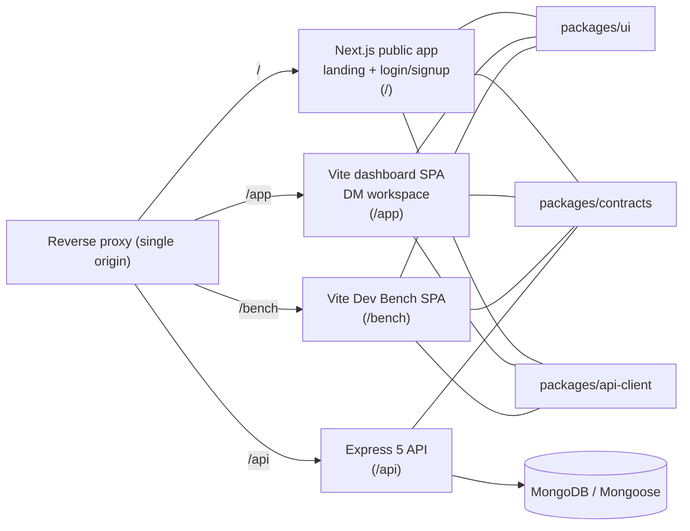
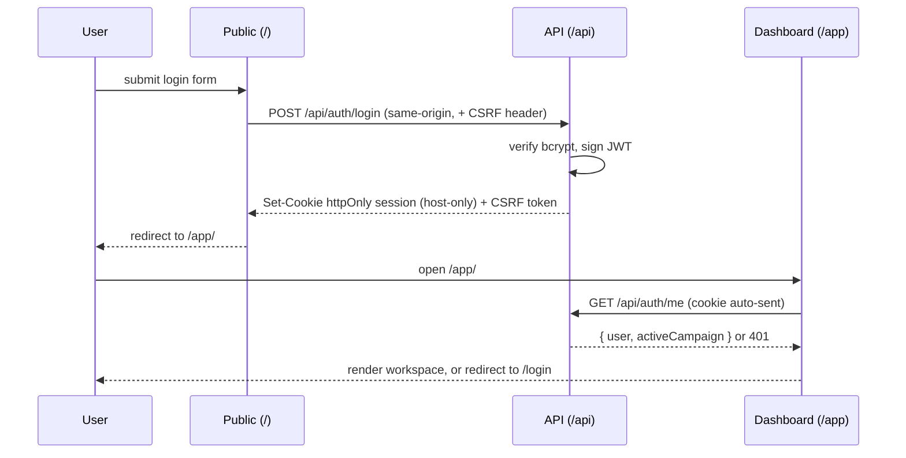

# Architecture

Cross-cutting overview of how the RPG World Builder monorepo fits together. For
app- and package-specific detail, follow the links into each workspace's own
README and `docs/`.

## Workspaces

```text
apps/
  public/      # Next.js (App Router): landing + login/signup   -> served at /
  dashboard/   # Vite + React SPA: authenticated DM workspace    -> served at /app
               # Storybook (:6007) for co-located composition stories
  bench/       # Vite + React SPA: Dev Bench workbench            -> served at /bench
  api/         # Express 5 + Mongoose: auth + domain API          -> served at /api
packages/
  config/      # shared tsconfig / eslint / prettier / vitest / storybook presets
  contracts/   # Zod schemas + inferred TS types (single source of truth)
  dev-bench-core/  # Dev Bench domain helpers (workflow, seeds, agent formatting)
  api-client/  # same-origin fetch + CSRF + auth helpers (fetchSession, logout)
  catalog/     # system SRD seed JSON + validated loaders (shared catalog data)
  ui/          # shadcn primitives, Tailwind v4 preset, design tokens
               # Storybook (:6006) for primitives, forms, recipes
tools/
  proxy/       # single-origin dev reverse proxy
  bench/       # @rpg/bench-cli — agent CLI (pnpm bench)
docs/          # this folder — cross-cutting architecture/env/run guides
```

| Workspace             | README                                                                          |
| --------------------- | ------------------------------------------------------------------------------- |
| `@rpg/public`         | [apps/public/README.md](../apps/public/README.md)                               |
| `@rpg/dashboard`      | [apps/dashboard/README.md](../apps/dashboard/README.md)                         |
| `@rpg/bench`          | [apps/bench/README.md](../apps/bench/README.md)                                 |
| `@rpg/api`            | [apps/api/README.md](../apps/api/README.md)                                     |
| `@rpg/config`         | [packages/config/README.md](../packages/config/README.md)                       |
| `@rpg/contracts`      | [packages/contracts/README.md](../packages/contracts/README.md)                 |
| `@rpg/dev-bench-core` | [packages/dev-bench-core/src/index.ts](../packages/dev-bench-core/src/index.ts) |
| `@rpg/bench-cli`      | [tools/bench/README.md](../tools/bench/README.md)                               |
| `@rpg/api-client`     | [packages/api-client/README.md](../packages/api-client/README.md)               |
| `@rpg/catalog`        | [packages/catalog/README.md](../packages/catalog/README.md)                     |
| `@rpg/ui`             | [packages/ui/README.md](../packages/ui/README.md)                               |

## Single-origin topology

All four apps sit behind **one origin**, routed by path. The browser only ever
talks to that single origin, which removes CORS, allows a host-only session
cookie, and keeps cross-app redirects as relative paths.



| Path     | App                             | Dev upstream            |
| -------- | ------------------------------- | ----------------------- |
| `/`      | Next public app                 | `http://localhost:3000` |
| `/app`   | Vite dashboard (code-split SPA) | `http://localhost:5173` |
| `/bench` | Vite Dev Bench SPA              | `http://localhost:5174` |
| `/api`   | Express API                     | `http://localhost:5001` |

In dev this routing is provided by
[`tools/proxy/dev-proxy.mjs`](../tools/proxy/dev-proxy.mjs) (listens on `:8080`);
in prod the platform's reverse proxy / CDN performs the same path routing. The
dashboard is built with Vite `base: "/app/"`, so it is served (and its router
runs) under `/app`. Dev Bench uses `base: "/bench/"` under `/bench`. Route
screens are lazy-loaded to keep the entry chunk small;
see [apps/dashboard/docs/code-splitting.md](../apps/dashboard/docs/code-splitting.md).

## Auth flow

Login/signup live **only** on the public app. The API issues a host-only
`httpOnly` session cookie plus a readable CSRF token (double-submit). The
dashboard gates itself by calling `GET /api/auth/me` and redirects
unauthenticated visitors back to the public `/login`.



The public app uses the same `GET /api/auth/me` contract for its header and to
redirect signed-in users away from `/login` and `/signup`. Cross-app navigation
paths (`/app/`, `/login`, `/app/profile`, …) are centralized as
`CROSS_APP_PATHS` in `@rpg/contracts`.

Details: [public auth forms](../apps/public/docs/auth-forms.md),
[dashboard auth guard](../apps/dashboard/docs/auth-guard.md),
and the API's cookie/CSRF model in [apps/api/README.md](../apps/api/README.md).

## Shared contracts & UI

- **`@rpg/contracts`** is the single source of truth for domain/DTO shapes:
  Zod schemas with `z.infer` types, organized under `shared/` (auth, users),
  `rpg/content/` (catalog types), `rpg/runtime/` (character sheets),
  and `rpg/campaign/` (campaign + ruleset patches). The API validates against
  them; apps reuse the same schemas with `@hookform/resolvers/zod`.
  Package layout → [packages/contracts/docs/structure.md](../packages/contracts/docs/structure.md).
  Campaign **rules vocabulary** (creature types, …) is documented in
  [vocabulary.md](./vocabulary.md).
- **`@rpg/api-client`** provides same-origin `fetch` wrappers (CSRF header,
  `ApiError`, `fetchSession`, `logout`) shared by the public and dashboard apps.
  No React dependency — apps wire it through TanStack Query hooks locally.
- **`@rpg/ui`** ships shadcn primitives, the Tailwind v4 preset, and design
  tokens (`@rpg/ui/styles.css`) consumed by both apps. Storybook is split:
  `@rpg/ui` on `:6006` for the design system; `@rpg/dashboard` on `:6007` for
  app composition stories. Shared Storybook factories live in
  [`@rpg/config/storybook`](../packages/config/README.md#storybook).

## Feature-first organization

Each app organizes code under `src/features/<feature>/` with a public `index.ts`
barrel. An ESLint boundary rule (`@rpg/config/eslint/base`) forbids importing
another feature's internals — cross-feature imports must go through its
`index.ts`. The dashboard's domain feature slots are documented in
[apps/dashboard/docs/feature-conventions.md](../apps/dashboard/docs/feature-conventions.md).

## Build & tooling

Turborepo orchestrates `build`, `lint`, `typecheck`, and `test` across
workspaces (`turbo.json`); pnpm workspaces manage dependencies. Shared TS, ESLint,
Prettier, and Vitest presets live in `@rpg/config`. See
[running.md](./running.md) and [environment.md](./environment.md).
