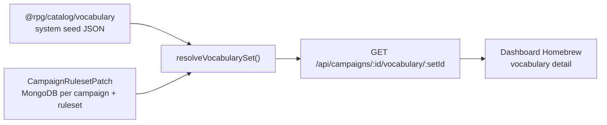

# Campaign vocabulary

Cross-cutting guide to **rules vocabulary** — closed option sets (creature types,
damage types, conditions, …) that a campaign can customize without creating
first-class catalog content. The dashboard surfaces this under **Homebrew**;
persistence and API contracts use neutral names (`campaign`, ruleset patch).

For catalog **content types** (classes, species, spells, …), see
[content-types.md](./content-types.md). For contracts layer rules, see
[packages/contracts/docs/structure.md](../packages/contracts/docs/structure.md).

---

## Two layers: seed vs patch

| Layer              | Location                                                     | What it stores                                                                                     |
| ------------------ | ------------------------------------------------------------ | -------------------------------------------------------------------------------------------------- |
| **System seed**    | `packages/catalog/src/vocabulary/data/<rulesetId>/`          | SRD rows: `id`, `label`, `description`. Validated at module load via `vocabularySeedOptionSchema`. |
| **Campaign patch** | `CampaignRulesetPatch` (`apps/api/src/features/vocabulary/`) | Deltas only — never a full copy of the seed list. One document per `(campaignId, rulesetId)`.      |

The API loads the campaign's `rulesetId` from the campaign record, reads seed
from catalog, merges any stored patch, and returns a **resolved set** with
`source`, `status`, and `usedBy` on each option.

Patch shape (contracts: `vocabularyOptionSetPatchSchema`):

| Field                     | Purpose                                                    |
| ------------------------- | ---------------------------------------------------------- |
| `systemEntryPatches`      | Override label, description, or `status` for a seed id     |
| `campaignEntries`         | Campaign-created options (`source: campaign` in responses) |
| `removedCampaignEntryIds` | Tombstones for deleted campaign entries                    |

System ids cannot be deleted — disable them via `systemEntryPatches.status:
'disabled'` instead.

---

## Why `campaign`, not `homebrew`

**Homebrew** is dashboard UX copy for the campaign customization hub. Database
and API language stay neutral:

- Vocabulary options created by a DM have `source: 'campaign'` (not
  `homebrew`).
- Content records use `Homebrew*` Mongoose models and `source: 'homebrew'` for
  **catalog entities** (classes, species, …).
- Rules vocabulary changes are **ruleset customizations** stored on
  `CampaignRulesetPatch`, separate from content homebrew documents.

The UI may render `source: 'campaign'` vocabulary rows as **Custom** in tables.

---

## Contracts and catalog

Shared shapes live in `@rpg/contracts`:

| Symbol                                    | Layer                                | Role                                                |
| ----------------------------------------- | ------------------------------------ | --------------------------------------------------- |
| `VOCABULARY_OPTION_SET_IDS`               | `vocab/vocabulary.ts`                | Known set ids (not all implemented in UI yet)       |
| `vocabularyOptionIdSchema`                | `vocab/`                             | Slug shape for stored ids — **not** a closed enum   |
| `vocabularyOptionSetPatchSchema`          | `vocab/`                             | Per-set delta inside a patch document               |
| `campaignRulesetPatchSchema`              | `platform/campaign-ruleset-patch.ts` | Full patch document (+ `rulesetId` from primitives) |
| `createVocabularyMemberSchema(activeIds)` | `vocab/`                             | Validates a value against resolved **active** ids   |
| `activeVocabularyOptionIds(set)`          | `vocab/`                             | Active id set from a resolved option set            |

**Closed reference vocab** (senses, damage types in traits, weapon properties)
remains in `vocab/*_ENTRIES` maps when the set is not campaign-customizable.

**Campaign-customizable sets** (creature types first) use catalog seed JSON +
patch merge instead of expanding a compile-time enum. Primitive shape validation
accepts any slug; **membership** is checked against the campaign-resolved set at
write time.

Catalog loader pattern (`packages/catalog/src/vocabulary/index.ts`):

- Parse JSON with `vocabularySeedOptionSchema` at import time.
- Assert unique ids in tests.
- Expose `loadSeedVocabularyOptionSet(rulesetId, setId)` and
  `seedVocabularyOptionIds(rulesetId, setId)`.
- Register new sets in `SEED_SETS_BY_RULESET`.

---

## API feature

Detail: [apps/api/src/features/vocabulary/README.md](../apps/api/src/features/vocabulary/README.md).

| Concern                   | Module                                      |
| ------------------------- | ------------------------------------------- |
| Merge logic               | `resolve-vocabulary.ts` (pure; unit-tested) |
| Persistence + CRUD        | `vocabulary.service.ts`                     |
| Campaign field validation | e.g. `assert-campaign-creature-types.ts`    |
| Hub card counts           | `homebrew-summary.service.ts`               |

Routes (under `/api/campaigns/:campaignId`):

| Method | Path                                  | Access           |
| ------ | ------------------------------------- | ---------------- |
| GET    | `/vocabulary`                         | member           |
| GET    | `/vocabulary/:setId`                  | member           |
| POST   | `/vocabulary/:setId/entries`          | owner / co-owner |
| PATCH  | `/vocabulary/:setId/entries/:entryId` | owner / co-owner |
| DELETE | `/vocabulary/:setId/entries/:entryId` | owner / co-owner |
| GET    | `/homebrew/summary`                   | member           |

Duplicate ids (shadowing seed or an existing campaign entry) return **409** via
`assertVocabularyIdAvailable`.

---

## Dashboard registries

The Homebrew feature (`apps/dashboard/src/features/homebrew/`) uses hub registries
under `lib/hub/` kept in sync with contracts via drift tests.

### Content cards (sidebar + hub)

`VISIBLE_SIDEBAR_CONTENT` in `lib/hub/content-registry.ts` must match
`HOMEBREW_SUMMARY_CONTENT_TYPES` in contracts — same types, same order. The hub
maps this array to cards; adding a summary content type without updating the
registry fails CI.

### Vocabulary sets (hub + detail rail)

`HOMEBREW_VOCABULARY_SETS` in `lib/hub/vocabulary-set-registry.ts` lists every
`VOCABULARY_OPTION_SET_ID` with a label and `enabled` flag. Only enabled sets
get hub cards and an active manager; disabled sets appear in the detail rail /
mobile select as not-yet-implemented.

### Rules configuration (hub)

`HOMEBREW_RULES_CONFIGS` in `lib/hub/rules-config-registry.ts` lists rules
configuration pages on the hub. In-page section anchors for character
configuration are derived from the campaign field registry
(`CHARACTER_CONFIGURATION_SECTIONS` in
`features/campaign/lib/character-configuration-field-registry.ts`).

Shared UI for all sets:

- Route: `/campaigns/:campaignId/homebrew/vocabulary/:setId`
- `VocabularySetNav` — desktop rail + mobile `Select`
- `VocabularyDetailContent` — table + `VocabularyEntrySheet` (Sheet primitive)
- `useVocabularySet` / `useVocabularyMutations` — TanStack Query against
  vocabulary API

Per-set consumption (forms, columns, settings) should use a thin hook that
loads the resolved set and builds label/active-id maps — see
`useCreatureTypeVocabulary` and `buildCreatureTypeVocabulary` in
`lib/vocabulary/sets/creature-types.ts`. Vocabulary-backed `<Form>` fields should
use `vocabularySelectField` / `vocabularyComboboxField` from
`lib/vocabulary/field-factories.ts` (options still come from the set hook, not
static seed constants).

---

## Adding the next vocabulary set

Work through these layers once; reuse resolver, routes, and detail UI.

### 1. Contracts

1. Confirm the set id is in `VOCABULARY_OPTION_SET_IDS` (add if new).
2. If content fields reference the set, use `vocabularyOptionIdSchema` (or
   `creatureTypeSchema`-style alias) for **shape** only — not `z.enum(CREATURE_TYPES)`.

### 2. Catalog seed

1. Add `packages/catalog/src/vocabulary/data/<rulesetId>/<set-id>.json`.
2. Register in `SEED_SETS_BY_RULESET` and export any set-specific helpers.
3. Extend `packages/catalog/src/vocabulary/index.test.ts` — count, unique ids,
   loader smoke test.

### 3. API validation

1. Add `assert*ActiveInCampaign(campaignId, ids)` using
   `resolveVocabularySetForCampaign` + `activeVocabularyOptionIds` (mirror
   `assert-campaign-creature-types.ts`).
2. Call it from content write paths and campaign settings that store the ids.
3. No new routes required — generic vocabulary CRUD already handles any seeded set.

### 4. Dashboard

1. Set `enabled: true` for the set in `HOMEBREW_VOCABULARY_SETS`.
2. Add a consumption hook if forms or columns need labels/options (pattern:
   `useCreatureTypeVocabulary`).
3. Wire field options through the hook — do not import static seed constants in
   components.

### 5. Tests

- `resolve-vocabulary.test.ts` — merge cases for the new set if patch behavior
  differs (usually shared tests suffice).
- Registry drift: `vocabulary-set-registry.test.ts` covers all
  `VOCABULARY_OPTION_SET_IDS`.
- Dashboard detail: extend `vocabulary-detail-content.test.tsx` or add set-specific
  assertions only when behavior differs from creature types.

Do **not** duplicate merge logic, patch persistence, or the vocabulary detail
shell per set.

---

## Internal-only vocabulary sets

Some sets are seeded in catalog and resolved through the vocabulary API for form
labels, but **not** exposed on the Homebrew hub (`enabled: false` in
`vocabulary-set-registry.ts`). Campaign managers cannot create or edit these rows
in the vocabulary UI.

| Set id                    | Used by                                     |
| ------------------------- | ------------------------------------------- |
| `edition-presets`         | Rules Configuration → Mechanics (RadioCard) |
| `attack-resolution-modes` | Rules Configuration → Mechanics (select)    |

Reference copy for edition presets includes `meta` chip strings in
`EDITION_PRESET_ENTRIES` (`@rpg/contracts`); seed JSON stores `id`, `label`, and
`description` only. Dashboard hooks:
`useEditionPresetVocabulary`, `useAttackResolutionModeVocabulary` — see
`lib/vocabulary/sets/edition-presets.ts` and `attack-resolution-modes.ts`.

Mechanics values persist on `CampaignRulesetPatch.mechanics` via
`PATCH /api/campaigns/:campaignId/ruleset-patch/mechanics` (not the vocabulary
patch routes).

---

## Validation conventions

### Shape vs membership

| Check             | When                              | How                                                            |
| ----------------- | --------------------------------- | -------------------------------------------------------------- |
| Slug shape        | Parse stored fields / API input   | `vocabularyOptionIdSchema`                                     |
| Active membership | Create/update content or settings | `createVocabularyMemberSchema(activeIds)` or API assert helper |
| Id availability   | Create vocabulary entry           | `assertVocabularyIdAvailable` (no shadowing seed ids)          |

Disabling a system option that is already referenced should be allowed in the
first pass; enforcement of "cannot disable/delete while in use" is centralized in
usage counting (below).

### Usage counts (`usedBy`)

`countVocabularyOptionUsage` in `vocabulary.service.ts` is the **single
enforcement point** for delete (and future disable) guards. It currently returns
`0` for all options until reference tracking is wired (species, campaign
settings, monsters, etc.).

- Resolved sets attach `usedBy` on every option for the management UI.
- Delete campaign entries succeeds when `usedBy === 0`; otherwise **409 in_use**.
- System entries cannot be deleted regardless of usage.

When adding a referencing feature, increment the stub for matching
`(campaignId, setId, entryId)` queries rather than adding ad-hoc delete checks.

---

## Related docs

- [architecture.md](./architecture.md) — monorepo topology and feature boundaries
- [content-types.md](./content-types.md) — catalog content vs reference vocab
- [apps/api/src/features/vocabulary/README.md](../apps/api/src/features/vocabulary/README.md) — route table and persistence summary
