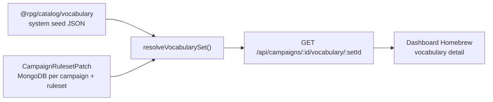

# Campaign vocabulary

Cross-cutting guide to **rules vocabulary** — closed option sets (creature types,
damage types, conditions, …) that a campaign can customize without creating
first-class catalog content. The dashboard surfaces this under **Homebrew**;
persistence and API contracts use neutral names (`campaign`, ruleset patch).

For catalog **content types** (classes, species, spells, …), see
[content-types.md](./content-types.md). For contracts layer rules, see
[packages/contracts/docs/structure.md](../packages/contracts/docs/structure.md).

---

## Two layers: seed vs patch



| Layer              | Location                                                         | What it stores                                                                                     |
| ------------------ | ---------------------------------------------------------------- | -------------------------------------------------------------------------------------------------- |
| **System seed**    | `packages/catalog/src/vocabulary/data/<rulesetId>/`              | SRD rows: `id`, `label`, `description`. Validated at module load via `vocabularySeedOptionSchema`. |
| **Campaign patch** | `CampaignRulesetPatch` (`apps/api/src/features/vocabulary/lib/`) | Deltas only — never a full copy of the seed list. One document per `(campaignId, rulesetId)`.      |

The API loads the campaign's `rulesetId` from the campaign record, reads seed
from catalog, merges any stored patch, and returns a **resolved set** with
`source`, `status`, and `usedBy` on each option.

Patch shape (contracts: `vocabularyOptionSetPatchSchema`):

| Field                     | Purpose                                                    |
| ------------------------- | ---------------------------------------------------------- |
| `systemEntryPatches`      | Override label, description, or `status` for a seed id     |
| `campaignEntries`         | Campaign-created options (`source: campaign` in responses) |
| `removedCampaignEntryIds` | Tombstones for deleted campaign entries                    |

System ids cannot be deleted — disable them via `systemEntryPatches.status:
'disabled'` instead.

---

## Why `campaign`, not `homebrew`

**Homebrew** is dashboard UX copy for the campaign customization hub. Database
and API language stay neutral:

- Vocabulary options created by a DM have `source: 'campaign'` (not
  `homebrew`).
- Content records use `Homebrew*` Mongoose models and `source: 'homebrew'` for
  **catalog entities** (classes, species, …).
- Rules vocabulary changes are **ruleset customizations** stored on
  `CampaignRulesetPatch`, separate from content homebrew documents.

The UI may render `source: 'campaign'` vocabulary rows as **Custom** in tables.

---

## Contracts and catalog

Shared shapes live in `@rpg/contracts`:

| Symbol                                    | Layer                                      | Role                                                 |
| ----------------------------------------- | ------------------------------------------ | ---------------------------------------------------- |
| `VOCABULARY_OPTION_SET_IDS`               | `rpg/vocab/vocabulary.ts`                  | Known set ids (not all implemented in UI yet)        |
| `VOCABULARY_SET_CAPABILITIES`             | `rpg/vocab/vocabulary-set-capabilities.ts` | Exhaustive product capability matrix per set         |
| `deriveVocabularyEntryId`                 | `rpg/vocab/vocabulary-entry-id.ts`         | Canonical slug derivation for create (API authority) |
| `vocabularyOptionIdSchema`                | `rpg/vocab/`                               | Slug shape for stored ids — **not** a closed enum    |
| `vocabularyOptionSetPatchSchema`          | `rpg/vocab/`                               | Per-set delta inside a patch document                |
| `campaignRulesetPatchSchema`              | `rpg/campaign/patches/ruleset.ts`          | Full patch document (+ `rulesetId` from primitives)  |
| `createVocabularyMemberSchema(activeIds)` | `rpg/vocab/`                               | Validates a value against resolved **active** ids    |
| `activeVocabularyOptionIds(set)`          | `rpg/vocab/`                               | Active id set from a resolved option set             |

**Closed reference vocab** (physical damage, weapon properties) remains in
`rpg/vocab/*_ENTRIES` maps when the set is not campaign-customizable. Each closed
map also exports a sibling `*_TERM` describing the set concept (label,
description, counted `sentence` forms). Open sets (damage types, senses, languages,
spell schools, creature types) export `*_TERM` plus `*_SET_ID` and use catalog seed
JSON + campaign patch instead.

**Campaign-customizable sets** (creature types first) use catalog seed JSON +
patch merge instead of expanding a compile-time enum. Primitive shape validation
accepts any slug; **membership** is checked against the campaign-resolved set at
write time.

Catalog loader pattern (`packages/catalog/src/vocabulary/index.ts`):

- Parse JSON with `vocabularySeedOptionSchema` at import time.
- Assert unique ids in tests.
- Expose `loadSeedVocabularyOptionSet(rulesetId, setId)` and
  `seedVocabularyOptionIds(rulesetId, setId)`.
- Register new sets in `SEED_SETS_BY_RULESET`.

---

## API feature

Detail: [apps/api/src/features/vocabulary/README.md](../apps/api/src/features/vocabulary/README.md).

| Concern                   | Module                                            |
| ------------------------- | ------------------------------------------------- |
| Merge logic               | `lib/resolve-vocabulary.ts` (pure; unit-tested)   |
| Persistence + CRUD        | `sets/vocabulary.service.ts`                      |
| Campaign field validation | e.g. `lib/assert-campaign-creature-types.ts`      |
| Ruleset patch             | `ruleset-patch/` (character-creation + mechanics) |

Routes (under `/api/campaigns/:campaignId`):

| Method | Path                                                       | Access           |
| ------ | ---------------------------------------------------------- | ---------------- |
| GET    | `/vocabulary`                                              | member           |
| GET    | `/vocabulary/:setId`                                       | member           |
| POST   | `/vocabulary/:setId/entries`                               | owner / co-owner |
| PATCH  | `/vocabulary/:setId/entries/:entryId`                      | owner / co-owner |
| DELETE | `/vocabulary/:setId/entries/:entryId`                      | owner / co-owner |
| GET    | `/vocabulary/:setId/entries/:entryId/disable-availability` | owner / co-owner |
| GET    | `/ruleset-patch`                                           | member           |
| PATCH  | `/ruleset-patch/character-creation`                        | owner / co-owner |
| PATCH  | `/ruleset-patch/mechanics`                                 | owner / co-owner |

Hub catalog counts (`GET /homebrew/summary`) live in the **content** feature —
see [content README](../apps/api/src/features/content/README.md).

Duplicate ids (shadowing seed, disabled system rows, or existing campaign entries)
return **409** via `assertVocabularyIdAvailable` against **all resolved option ids**.

Mutating routes enforce `VOCABULARY_SET_CAPABILITIES` server-side:

| Operation                            | Capability     | Failure        |
| ------------------------------------ | -------------- | -------------- |
| POST entry                           | `create`       | 403            |
| PATCH label/description              | `edit`         | 403            |
| PATCH status                         | `availability` | 403            |
| DELETE entry                         | `delete`       | 403            |
| GET disable-availability             | `disableGuard` | 404            |
| PATCH status → disabled (referenced) | `disableGuard` | 409 + blockers |

Partial API registries (creature-types species resolver registered today):

| Registry                         | Location                                         | Role                                         |
| -------------------------------- | ------------------------------------------------ | -------------------------------------------- |
| `VOCABULARY_USAGE_RESOLVERS`     | `apps/api/.../vocabulary-usage-resolvers.ts`     | Usage counts + `kind: 'content'` blockers    |
| `VOCABULARY_VALIDATION_ADAPTERS` | `apps/api/.../vocabulary-validation-adapters.ts` | Optional validation beyond active membership |
| `VOCABULARY_ENTRY_FORM_REGISTRY` | dashboard `vocabulary-entry-form-registry.ts`    | Create/edit form defs for enabled sets       |

Shared dashboard extractions (dual consumers — content + vocabulary):

| Module                    | Path                                                          |
| ------------------------- | ------------------------------------------------------------- |
| Unavailable row chrome    | `@/lib/overview/overview-unavailable-chrome.ts`               |
| Availability filter field | `@/lib/overview/create-campaign-availability-filter-field.ts` |
| Bulk actions menu shell   | `@/lib/overview/overview-bulk-actions-menu.client.tsx`        |
| Usage blocked list        | `@/lib/usage-blocked/usage-blocked-list.client.tsx`           |

---

## Dashboard registries

The Homebrew feature (`apps/dashboard/src/features/homebrew/`) uses hub registries
under `lib/hub/` kept in sync with contracts via drift tests.

### Content cards (sidebar + hub)

`VISIBLE_SIDEBAR_CONTENT` in `lib/hub/content-registry.ts` must match
`HOMEBREW_SUMMARY_CONTENT_TYPE_KEYS` in contracts — same types, same order. The hub
maps this array to cards; adding a summary content type without updating the
registry fails CI.

### Vocabulary sets (hub + detail rail)

`HOMEBREW_VOCABULARY_SETS` in `lib/hub/vocabulary-set-registry.ts` lists every
`VOCABULARY_OPTION_SET_ID` with a label. **`enabled` is derived from
`VOCABULARY_SET_CAPABILITIES.overview`** — do not maintain a parallel enable list.
Only overview-capable sets get hub cards and an active manager; other sets appear
in the detail rail / mobile select as not-yet-implemented.

### Rules configuration (hub)

`HOMEBREW_RULES_CONFIGS` in `lib/hub/rules-config-registry.ts` lists rules
configuration pages on the hub. In-page section anchors for character
configuration are derived from the campaign field registry
(`CHARACTER_CONFIGURATION_SECTIONS` in
`features/campaign/lib/rules/character-configuration/character-configuration-form-fields.ts`).

Shared UI for all sets:

- Route: `/campaigns/:campaignId/homebrew/vocabulary/:setId`
- `VocabularySetNav` — desktop rail + mobile `Select`
- `VocabularyDetailContent` — table + `VocabularyEntrySheet` (Sheet primitive)
- `useVocabularySet` / `useVocabularyMutations` — TanStack Query against
  vocabulary API

Per-set consumption (forms, columns, settings) should use a thin hook that
loads the resolved set and builds label/active-id maps — see
`useCreatureTypeVocabulary` and `buildCreatureTypeVocabulary` in
`lib/vocabulary/sets/creature-types.ts`. Vocabulary-backed `<Form>` fields should
use `vocabularySelectField` / `vocabularyComboboxField` from
`lib/vocabulary/field-factories.ts` (options still come from the set hook, not
static seed constants).

---

## Adding the next vocabulary set

Work through these layers once; reuse resolver, routes, and detail UI.

### 1. Contracts

1. Confirm the set id is in `VOCABULARY_OPTION_SET_IDS` (add if new).
2. If content fields reference the set, use `vocabularyOptionIdSchema` (or
   `creatureTypeSchema`-style alias) for **shape** only — not `z.enum(CREATURE_TYPES)`.

### 2. Catalog seed

1. Add `packages/catalog/src/vocabulary/data/<rulesetId>/<set-id>.json`.
2. Register in `SEED_SETS_BY_RULESET` and export any set-specific helpers.
3. Extend `packages/catalog/src/vocabulary/index.test.ts` — count, unique ids,
   loader smoke test.

### 3. API validation

1. Add `assert*ActiveInCampaign(campaignId, ids)` using
   `resolveVocabularySetForCampaign` + `activeVocabularyOptionIds` (mirror
   `assert-campaign-creature-types.ts`).
2. Call it from content write paths and campaign settings that store the ids.
3. No new routes required — generic vocabulary CRUD already handles any seeded set.

### 4. Dashboard

1. Flip capability flags in `VOCABULARY_SET_CAPABILITIES` (`overview`, `create`, …).
2. Register a form def in `VOCABULARY_ENTRY_FORM_REGISTRY` when `create`/`edit` are true.
3. Register an API usage resolver when `usageCounting` / `disableGuard` / `deleteGuard` need custom logic.
4. Add a consumption hook if forms or columns need labels/options (pattern:
   `useCreatureTypeVocabulary` or generic `useVocabularySetMaps`).
5. Wire field options through the hook — do not import static seed constants in
   components.

### 5. Tests

- `resolve-vocabulary.test.ts` — merge cases for the new set if patch behavior
  differs (usually shared tests suffice).
- Registry drift: `vocabulary-set-registry.test.ts` covers all
  `VOCABULARY_OPTION_SET_IDS`.
- Dashboard detail: extend `vocabulary-detail-content.test.tsx` or add set-specific
  assertions only when behavior differs from creature types.

Do **not** duplicate merge logic, patch persistence, or the vocabulary detail
shell per set.

---

## Internal-only vocabulary sets

Some sets are seeded in catalog and resolved through the vocabulary API for form
labels, but **not** exposed on the Homebrew hub (`enabled: false` in
`vocabulary-set-registry.ts`). Campaign managers cannot create or edit these rows
in the vocabulary UI.

| Set id                    | Used by                                     |
| ------------------------- | ------------------------------------------- |
| `edition-presets`         | Rules Configuration → Mechanics (RadioCard) |
| `attack-resolution-modes` | Rules Configuration → Mechanics (select)    |

Reference copy for edition presets includes `meta` chip strings in
`EDITION_PRESET_ENTRIES` (`@rpg/contracts`); seed JSON stores `id`, `label`, and
`description` only. Dashboard hooks:
`useEditionPresetVocabulary`, `useAttackResolutionModeVocabulary` — see
`lib/vocabulary/sets/edition-presets.ts` and `attack-resolution-modes.ts`.

Mechanics values persist on `CampaignRulesetPatch.mechanics` via
`PATCH /api/campaigns/:campaignId/ruleset-patch/mechanics` (not the vocabulary
patch routes).

---

## Validation conventions

### Shape vs membership

| Check             | When                              | How                                                                                                                                                   |
| ----------------- | --------------------------------- | ----------------------------------------------------------------------------------------------------------------------------------------------------- |
| Slug shape        | Parse stored fields / API input   | `vocabularyOptionIdSchema`                                                                                                                            |
| Active membership | Create/update content or settings | `createVocabularyMemberSchema(activeIds)` or API assert helper                                                                                        |
| Id availability   | Create vocabulary entry           | `assertVocabularyIdAvailable` — ids are **reserved within the set** regardless of `status` or `source` (system seed, disabled patch, or campaign row) |

Create accepts an optional client-proposed id for preview; the API re-derives from
`label` via `deriveVocabularyEntryId` and rejects a mismatch (**400**) or collision
(**409**). Disabling an option does not free its id for reuse.

Disabling a system option that is already referenced should be allowed in the
first pass; enforcement of "cannot disable/delete while in use" is centralized in
usage counting (below).

### Usage counts (`usedBy`)

`VOCABULARY_USAGE_RESOLVERS` in the API is the **single enforcement point** for
delete and disable guards. Creature-types counts species references and returns
`kind: 'content'` blockers for disable preflight and PATCH 409 races.

- Resolved sets attach `usedBy` on every option when `usageCounting` is true.
- Delete campaign entries succeeds when `usedBy === 0` (or `deleteGuard` is off); otherwise **409 in_use**.
- Disable (status → disabled) runs preflight via `GET …/disable-availability`; PATCH returns **409** with blockers when referenced.
- System entries cannot be deleted regardless of usage.

When adding a referencing feature, extend the set's usage resolver rather than adding ad-hoc delete checks.

### Set capabilities registry

`VOCABULARY_SET_CAPABILITIES` in `@rpg/contracts` is the **runtime SSOT** for which
operations each set supports (overview, create, availability, usage guards, …).
Dashboard and API registries derive **enabled subsets** from this map; drift tests
assert every contract set id has an explicit row. Catalog seed presence is
**ruleset-specific** (`@rpg/catalog`) — not stored in capabilities.

Integration ownership notes live in
[`tools/vocab/set-integration`](tools/vocab/set-integration/) (discoverability only).

---

## Consuming reference vocabulary in UI

Display code should never render raw vocabulary slugs. Use label helpers from
`@rpg/contracts` (`get*Label()`, `format*()`, `*_ENTRIES` maps,
`vocabularyTermLabel`, `vocabularyTermFieldCopy`) so copy stays consistent with
catalog seed and campaign patches.

### Four layers (do not mix)

| Layer                            | Owns                                       | Example                             |
| -------------------------------- | ------------------------------------------ | ----------------------------------- |
| **`*_TERM`**                     | What the taxonomy is called and means      | `Creature Type`, `creature type`    |
| **`*_ENTRIES` / resolved vocab** | Permitted or canonical values              | `Humanoid`, campaign-patched labels |
| **Option-set registry**          | Which taxonomies are campaign-configurable | `VOCABULARY_OPTION_SET_TERMS`       |
| **Message catalogs**             | Complete UI sentences                      | `defineMessage` validation copy     |

`*_TERM` supplies **nouns and noun phrases** only. Message catalogs own full
workflow and validation sentences — embed `getTermSentenceForm(TERM, n)` inside
`defineMessage` formatters; do not generate entire messages from term metadata.

Contracts grammar (`vocabularyTermLabel`, `vocabularyTermFieldCopy`) is
surface-neutral. Dashboard wrappers (`vocabularyHubLabel`, `vocabularyFieldLabel`)
apply product casing conventions.

### Campaign vocab vs closed reference sets

| Source                                                    | Examples                                               | Consumption                                                                                                                                             |
| --------------------------------------------------------- | ------------------------------------------------------ | ------------------------------------------------------------------------------------------------------------------------------------------------------- |
| **Campaign vocab** (`VOCABULARY_OPTION_SET_IDS`)          | Creature types, damage types, languages                | Resolve per campaign via vocabulary API; build label maps from the resolved set (see [Adding the next vocabulary set](#adding-the-next-vocabulary-set)) |
| **Closed reference vocab** (`*_ENTRIES`, `GameTermEntry`) | Weapon properties, armor categories, magic item rarity | Import label helpers from `rpg/vocab/*`; no campaign patch merge                                                                                        |

Catalog **content types** (classes, species, equipment, …) are separate — see
[content-types.md](./content-types.md). The shared `pnpm vocab:audit` policy and
the deferred usage-budget regression-gate TODO also live there.

### Compact display pattern

Equipment picker rows use a contracts-side segment assembler in
[`equipment-compact-display.ts`](../packages/contracts/src/rpg/content/lib/equipment-compact-display.ts):

1. **Field formatters** — each `CompactFieldId` maps catalog data to one display segment via vocab label helpers.
2. **Layout registry** — per `EquipmentKind`, a priority-ordered `fields` list with optional `{ firstAvailable: [...] }` fallback slots.
3. **Assembler** — walks slots in order, skips redundant segments, caps intrinsic `metadata` at three segments; `kindLabel` and contextual callouts sit outside the cap.

Dashboard surfaces call `buildEquipmentCompactSummary()` through
[`buildEquipmentPickerRowViewModel`](../apps/dashboard/src/features/content/equipment/lib/equipment-display.ts);
the picker UI joins segments with `EQUIPMENT_COMPACT_SEPARATOR`.

### Dashboard consumption examples

```ts
// Hub / nav — plural taxonomy names with product casing
vocabularyHubLabel(getVocabularyOptionSetTerm('creature-types')) // → "Creature Types"

// Form field chrome — sentence-case singular or plural
vocabularyFieldLabel(CREATURE_TYPE_TERM) // → "Creature type"
vocabularySelectFieldForTerm(CREATURE_TYPE_TERM, { name: 'creatureType', options })

// Validation — embed noun phrases inside defineMessage formatters
defineMessage(
  'validation.species.creatureTypeUnavailable',
  () =>
    `This ${getTermSentenceForm(CREATURE_TYPE_TERM, 1)} is not available in this campaign vocabulary.`,
)

// Detail rows — title-case taxonomy concept label
getVocabularyTermLabel(MAGIC_ITEM_RARITY_TERM) // → "Magic Item Rarity"
```

---

## Related docs

- [architecture.md](./architecture.md) — monorepo topology and feature boundaries
- [content-types.md](./content-types.md) — catalog content vs reference vocab
- [apps/api/src/features/vocabulary/README.md](../apps/api/src/features/vocabulary/README.md) — route table and persistence summary
