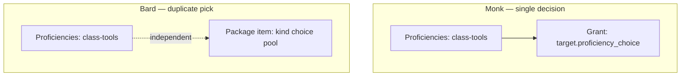

# Character builder equipment ↔ proficiency patterns

How class starting equipment can depend on tool proficiency choices. Two SRD patterns
ship today; choose based on whether the player should make **one** decision or **two**.

## Core rule

A proficiency-linked equipment grant may render its referenced ChoiceSet in the selected
package card.

The **resolved ChoiceSet is authoritative** for label, options, and validation. Both
steps read and write the same `choiceSelections` entry. Package changes may hide the
inline field but **must never clear** the underlying proficiency answer.

## Pattern comparison

|                       | **Monk** (proficiency-linked grant)                                                      | **Bard** (nested equipment choice)                                 |
| --------------------- | ---------------------------------------------------------------------------------------- | ------------------------------------------------------------------ |
| Player decisions      | **One** — tool proficiency pick only                                                     | **Two** — tool proficiency + starting-equipment instrument         |
| Proficiencies step    | `characterCreation.proficiencies.tools` ChoiceSet (`class-tools`)                        | Same — `class-tools` musical-instrument pool                       |
| Starting equipment    | `kind: 'grant'` with `target.proficiency_choice`                                         | `kind: 'choice'` equipment pool in the package                     |
| Equipment step picker | May expose the referenced proficiency ChoiceSet inline; no duplicate equipment ChoiceSet | **Yes** — nested `starting-equipment:{optionId}:{index}` ChoiceSet |
| Resolution source     | `draft.choiceSelections[class:{classId}:class-tools]`                                    | Nested equipment ChoiceSet answer                                  |
| Readiness             | `getUnresolvedStartingEquipmentDependencies` blocks until proficiency answered           | Equipment-step ChoiceSet must be satisfied                         |



## When to use each

### `target.proficiency_choice` (Monk)

Use when the starting package should grant **the same tool** the player already chose
for their tool proficiency.

```json
{
  "kind": "grant",
  "target": { "source": "proficiency_choice", "choiceId": "class-tools" },
  "quantity": 1
}
```

**Requirements (enforced at authoring):**

- Referenced `choiceId` exists on the same class's `characterCreation.proficiencies.tools`
- `choose === 1`
- Pool expands to at least one catalog tool (`resolveEligibleProficiencyChoiceTargets`)
- No `modifiers` on the grant (v1)
- Duplicate links invalid only within the same package (not class-wide)

**Runtime:** `resolveProficiencyLinkedEquipmentGrant` reads the proficiency ChoiceSet
answer directly. Never infer from `assembleCharacterProficiencies()` or merged rows.

**ChoiceSet id:** `class:{classId}:{choiceId}` (e.g. `class:srd-cc-5.2.1:monk:class-tools`).

**Builder UX:** When the linked package is selected, the equipment step may render the
referenced proficiency ChoiceSet inline (section label: "Included tool"). Player-facing
copy avoids internal ids like `class-tools`. Switching to gold hides the field but
preserves the shared answer.

### `kind: 'choice'` pool (Bard)

Use when starting equipment includes a **separate** equipment pick — even when the pool
overlaps with the proficiency pool (e.g. Bard picks proficiency on three instruments and
starting equipment on one instrument).

```json
{
  "kind": "choice",
  "choose": 1,
  "pool": {
    "source": "filtered",
    "equipmentKind": "tool",
    "toolCategory": "musical_instrument"
  }
}
```

**Runtime:** nested equipment ChoiceSet via `nestedStartingEquipmentChoiceSetId`.

## Authoring UX

Class starting-equipment grant rows support **Specific equipment** vs **Proficiency
choice** (`allowProficiencyChoiceTarget: true`). Trait/content grants keep
`equipmentSlug` only.

Package `description` is display prose only — linkage semantics live on grant rows.

## Follow-up

- **Bard deduplication:** evaluate migrating Bard to `proficiency_choice` or documenting
  intentional duplicate pick as a third pattern variant.
- Campaign allow/deny filtering in pool expansion (not v1).

## Related modules

| Module                                              | Role                                          |
| --------------------------------------------------- | --------------------------------------------- |
| `resolve-proficiency-linked-equipment-grant.ts`     | Pending / invalid / resolved grant resolution |
| `get-unresolved-starting-equipment-dependencies.ts` | Equipment-step readiness dependencies         |
| `resolve-eligible-proficiency-choice-targets.ts`    | Authoring eligibility                         |
| `validate-starting-equipment-proficiency-links.ts`  | Class save validation                         |
| `resolve-starting-equipment-choice-sets.ts`         | Nested equipment ChoiceSets (Bard path)       |
