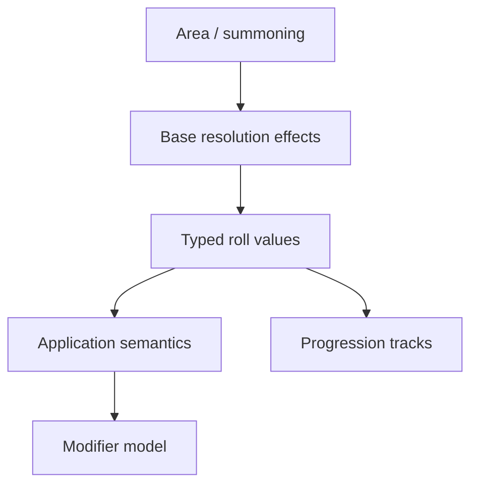

# Spell mechanics roadmap

Schema capability registry and staged additions for spell resolution, progression,
and modeling. Complements the exploratory analysis in
[`docs/analysis/spell-progression-modeling.md`](../../docs/analysis/spell-progression-modeling.md).

## Current modeled capabilities

| Capability                                                 | Location                                               |
| ---------------------------------------------------------- | ------------------------------------------------------ |
| Resolution envelope (selection, method, effects, outcomes) | `packages/contracts/src/rpg/content/spell/resolution/` |
| Application patterns (projectiles, fixed count)            | `resolution/schema.ts`                                 |
| Progression tracks (linear, threshold)                     | `resolution/progression/`                              |
| Modeling metadata (status ladder, gaps)                    | `packages/contracts/src/rpg/primitives/modeling/`      |
| Spell `modeling` field on body                             | `packages/contracts/src/rpg/content/spell/body.ts`     |
| Catalog seeds + manifest                                   | `packages/catalog/src/spells/`                         |

## Modeling status promotion criteria

| Status                           | Requirements                                                     |
| -------------------------------- | ---------------------------------------------------------------- |
| `meaningful-partial`             | Valid `resolution`; schema round-trip; dashboard form round-trip |
| `sufficient-for-display`         | Above + `formatResolutionSummarySections` smoke test             |
| `sufficient-for-character-sheet` | Above + resolvable values for current character context          |
| `mechanics-ready`                | Complete outcome graph for declared scope                        |

Enforced by `validateSpellModelingPromotion` in
`packages/contracts/src/rpg/content/spell/modeling/validation.ts` and catalog audit tests.

Operational inventory: [`docs/analysis/spell-modeling-inventory.generated.md`](../../docs/analysis/spell-modeling-inventory.generated.md).

## Gap code registry

Stable vocabulary in `packages/contracts/src/rpg/content/spell/modeling/`:

- **Targeting:** `dynamic-target-count`, `chosen-within-area`, `chained-targets`, …
- **Application:** `per-projectile-application`, `modifier-model-missing`, …
- **Environment:** `flammability-rules`, `summoning-model-missing`, …

`capabilityId` on gap entries is optional — add only when a registry entry exists.

## Staged schema additions

See analysis doc §7 for the full staged roadmap (base effects → typed values →
application semantics → modifier model → area/summoning siblings).

**Non-goals:** combat automation, prose inference, universal effect engine.

## Dependency graph (high level)

## Migration expectations

- Additive-only schema fields on spells and resolution
- Deep-merge for campaign overlays
- `modeling` metadata updated via manifest apply, not hand-edited JSON in bulk
