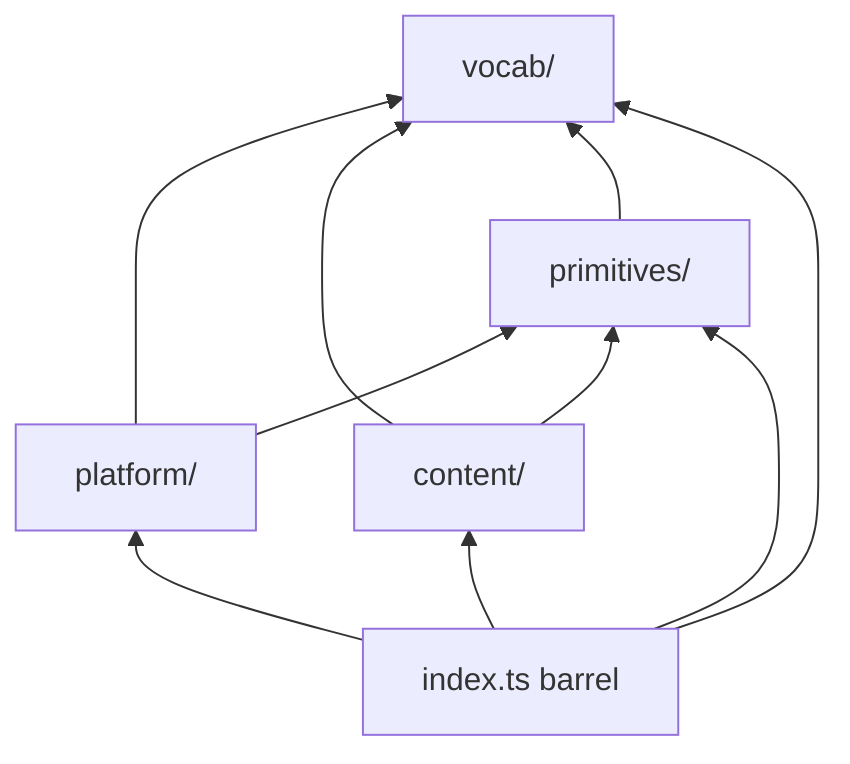

# Contracts package structure

`@rpg/contracts` is organized into four layers under `src/`. Each layer has a
focused responsibility; imports flow **downward** only (see dependency rules
below). The root barrel (`src/index.ts`) re-exports everything so existing
`import { … } from '@rpg/contracts'` usage stays unchanged.

## Layer diagram

```text
packages/contracts/src/
  index.ts              # flat re-export of all layers (public API)

  vocab/                # closed-set game terms (labels, SRD text, Zod enums)
  primitives/           # shared value types (levels, dice, units, ruleset id)
  content/              # catalog content types (species, weapons, classes, …)
  platform/             # auth, users, campaigns, uploads, errors, assets
```



## Where to put new modules

| You are adding…                                      | Layer         | Example path                                   |
| ---------------------------------------------------- | ------------- | ---------------------------------------------- |
| A closed id set with labels (and optional SRD text)  | `vocab/`      | `vocab/sense.ts`, `vocab/weapon/property.ts`   |
| A reusable value type used across content types      | `primitives/` | `primitives/dice.ts`, `primitives/level.ts`    |
| A catalog content type or its DTOs/patches           | `content/`    | `content/species.ts`, `content/class/class.ts` |
| Auth, session, campaign, upload, or API error shapes | `platform/`   | `platform/auth.ts`, `platform/campaign.ts`     |

Nested folders are fine when a domain splits cleanly (e.g. `content/class/`
for spellcasting + class body, `vocab/weapon/` for weapon term maps).

Each layer has an `index.ts` barrel. Re-export new public symbols from that
barrel (and from `src/index.ts` only if you add a new top-level layer — the
root barrel already re-exports all four).

## Dependency rules

Acyclic **downward** imports only — lower layers never import higher layers.

| Layer               | May import                           | Must not import                        |
| ------------------- | ------------------------------------ | -------------------------------------- |
| `vocab/`            | `vocab/`                             | `primitives/`, `content/`, `platform/` |
| `primitives/`       | `vocab/`, `primitives/`              | `content/`, `platform/`                |
| `content/`          | `vocab/`, `primitives/`, `content/`  | `platform/`                            |
| `platform/`         | `vocab/`, `primitives/`, `platform/` | `content/`                             |
| `index.ts` (barrel) | all layers                           | — (re-exports only; no runtime logic)  |

**Not enforced:** requiring `content/` to reach `vocab/` only via
`primitives/`. Content types legitimately import vocab schemas directly (e.g.
`creatureSizeSchema`, `weaponCategorySchema`). The rule blocks upward leaks,
not “skip a layer” shortcuts.

Deep relative imports (`../vocab/sense`) and barrel imports (`../vocab`) are
both valid within the allowed graph.

## ESLint enforcement

Layer boundaries are enforced in [`eslint.config.js`](../eslint.config.js) via
`eslint-plugin-boundaries` (`boundaries/dependencies`, `default: 'disallow'`).

- **Production code** under `src/**/*.{ts,tsx}` is checked.
- **Co-located tests** (`*.test.ts`, `*.test.tsx`) are excluded — they may
  import the module under test freely.
- Violations fail `pnpm lint --filter @rpg/contracts` with a message pointing
  here.

If lint fails after a move, fix the import or relocate the module to the
correct layer. Do not add lint exceptions for cross-layer imports.

## Subpath exports

Prefer the root import for app code unless you want an explicit layer boundary
in the import path:

| Import path                 | Resolves to               | Typical use                           |
| --------------------------- | ------------------------- | ------------------------------------- |
| `@rpg/contracts`            | `src/index.ts`            | Default — all symbols, unchanged API  |
| `@rpg/contracts/vocab`      | `src/vocab/index.ts`      | Label/format helpers, reference enums |
| `@rpg/contracts/primitives` | `src/primitives/index.ts` | Dice, levels, ruleset id              |
| `@rpg/contracts/content`    | `src/content/index.ts`    | Content schemas and DTOs              |
| `@rpg/contracts/platform`   | `src/platform/index.ts`   | Auth, user, campaign, assets          |

Examples:

```ts
// Root barrel (recommended default)
import { speciesSchema, getSenseLabel } from '@rpg/contracts'

// Layer subpaths (optional — same symbols, explicit boundary)
import { getSenseLabel, SENSE_ENTRIES } from '@rpg/contracts/vocab'
import { speciesSchema, contentMetaSchema } from '@rpg/contracts/content'
import { loginInputSchema } from '@rpg/contracts/platform'
```

Subpath exports are defined in [`package.json`](../package.json) `exports`.

## Reference vocabulary (`GameTermEntry`)

Closed game-term maps live in `vocab/`. Shared shape in `vocab/types.ts`:

```ts
export type GameTermEntry = {
  readonly label: string
  readonly description: string
}
```

Pattern: `*_ENTRIES` map → derived id tuple → `z.enum` schema →
`get*Entry` / `get*Label` helpers. See `vocab/sense.ts`, `vocab/alignment.ts`,
`vocab/weapon/property.ts`, and `vocab/armor/category.ts`. Co-located
`*.test.ts` files assert every entry has non-empty `label` and `description`.

Entity-specific fields (e.g. a weapon's `specialRules` text) stay on the
content schema in `content/`, not in vocab maps.

## Adding a schema

1. Pick the layer (table above).
2. Add a focused module with Zod schemas; derive types with `z.infer`.
3. Re-export from the layer's `index.ts` (root barrel picks it up automatically).
4. Add a co-located `*.test.ts` for validation behavior.

For catalog content types, follow [docs/content-types.md](../../../docs/content-types.md).
