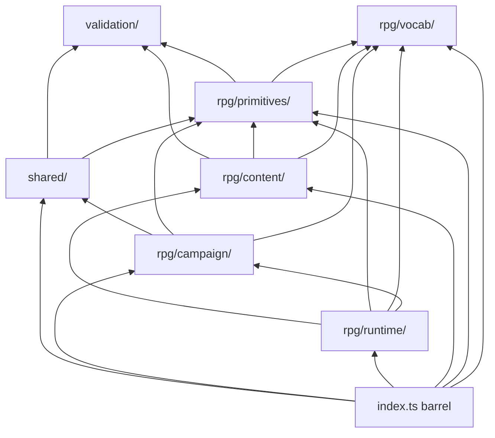

# Contracts package structure

`@rpg/contracts` is organized into layers under `src/`. The RPG game domain uses
five layers with **downward** imports (see dependency rules below). The root
barrel (`src/index.ts`) re-exports `shared/` plus everything under `rpg/` so
existing `import { … } from '@rpg/contracts'` usage stays unchanged.

**Dev Bench** (`dev-bench/`) is isolated for the local workbench product — import
`@rpg/contracts/dev-bench` explicitly. **Name generator** (`name-generator/`) is
isolated experimental naming contracts — import `@rpg/contracts/name-generator`
explicitly. **Public** (`public/`) is a scaffold for
future marketing/CMS contracts — import `@rpg/contracts/public` when added.

## Layer diagram

```text
packages/contracts/src/
  index.ts              # flat re-export of validation + shared + rpg (not dev-bench, not public)

  validation/           # defineMessage primitive + global validation message catalog
  shared/               # auth, user, roles, routes, errors, csrf, upload, assets
  rpg/
    vocab/              # closed-set game terms + open vocabulary set ids
    primitives/         # shared value types (levels, dice, units, authored content, ruleset id)
    content/            # catalog content types (species, weapons, classes, …)
      lib/              # envelope, grants, content-key, content-type-keys, …
      classes/          # class body, spellcasting, subclasses
        spellcasting/   # spellcasting schema + slot progression tables
    runtime/            # stored character sheets + builder runtime (not catalog content)
      character/        # sheet schema, provenance, proficiencies, inventory
      character-builder/ # builder draft, context, choice/step orchestration
    character-builder/  # boundary-neutral builder wire contracts (step ids, validation issues)
    campaign/           # campaign identity, templates, rules, selection, patches/
  platform/             # backward-compat shim → shared + rpg/campaign
  public/               # scaffold (marketing/CMS — future)
  dev-bench/            # Dev Bench tickets, epics (isolated)
```



## Where to put new modules

| You are adding…                                                                          | Layer                               | Example path                                                                                                                 |
| ---------------------------------------------------------------------------------------- | ----------------------------------- | ---------------------------------------------------------------------------------------------------------------------------- |
| A shared validation message or message primitive                                         | `validation/`                       | `validation/messages.ts` (see [validation-messages.md](validation-messages.md))                                              |
| A closed id set with labels (and optional SRD text)                                      | `rpg/vocab/`                        | `rpg/vocab/sense.ts`, `rpg/vocab/weapon/property.ts`, `rpg/vocab/personal-name-component.ts`                                 |
| A reusable value type used across content types                                          | `rpg/primitives/`                   | `rpg/primitives/dice.ts`, `rpg/primitives/units.ts`, `rpg/primitives/authored-content.ts`                                    |
| Shared proficiency grant/choice input schemas (content + campaign)                       | `rpg/primitives/proficiency/`       | `proficiency-grant-set.ts`, `character-creation-proficiency-rules.ts`                                                        |
| Weapon mode presentation formatters (extracted from vocab)                               | `rpg/primitives/weapon/`            | `mode-compatibility-messages.ts`                                                                                             |
| Catalog content type or its DTOs/patches                                                 | `rpg/content/`                      | `rpg/content/species.ts`, `rpg/content/classes/class.ts`                                                                     |
| Shared content helpers (grants, envelope, keys)                                          | `rpg/content/lib/`                  | `rpg/content/lib/grants.ts`                                                                                                  |
| Creature-like runtime primitives (PC, NPC, monster)                                      | `rpg/runtime/creature/`             | `languages.ts`, `equipment.ts`, `spellcasting.ts` — see [runtime-resolution-boundaries.md](runtime-resolution-boundaries.md) |
| A stored character sheet or builder runtime contract                                     | `rpg/runtime/`                      | `rpg/runtime/character/sheet.ts` — see [runtime-resolution-boundaries.md](runtime-resolution-boundaries.md)                  |
| Composed campaign-character wire DTOs (not campaign rules)                               | `rpg/runtime/campaign/`             | `npc-dtos.ts`, `pc-list-item-dto.ts`, `party-pc-list-item-dto.ts`                                                            |
| Campaign eligibility resolver orchestration                                              | `rpg/runtime/campaign-eligibility/` | `resolve-character-campaign-eligibility.ts`                                                                                  |
| RPG character list-card view models                                                      | `rpg/runtime/character/`            | `character-card-dtos.ts`                                                                                                     |
| Campaign content viewer authorization model                                              | `rpg/campaign/lib/`                 | `campaign-content-viewer.ts`                                                                                                 |
| Campaign eligibility wire contracts (issues/warnings only)                               | `rpg/campaign/`                     | `character-eligibility-contracts.ts`                                                                                         |
| Serializable character-builder wire contracts (step ids, validation issues, acquisition) | `rpg/character-builder/`            | `rpg/character-builder/step-ids.ts` — import via `@rpg/contracts/rpg/character-builder`                                      |
| Campaign identity, templates, membership, ruleset patches                                | `rpg/campaign/`                     | `rpg/campaign/campaign.ts`, `rpg/campaign/campaign-template.ts`, `rpg/campaign/patches/`                                     |
| Campaign rule bodies (not catalog content types)                                         | `rpg/campaign/rules/`               | `rpg/campaign/rules/starting-wealth.ts`                                                                                      |
| Auth, session, upload, or API error shapes                                               | `shared/`                           | `shared/auth.ts`, `shared/errors.ts` — product-neutral only; do not park RPG view models here                                |
| Dev Bench ticket/epic schemas and input DTOs                                             | `dev-bench/`                        | `dev-bench/ticket.ts`                                                                                                        |
| Name generator conventions, collections, and generation                                  | `name-generator/`                   | `name-generator/naming-convention.ts`                                                                                        |
| Public marketing or CMS schemas                                                          | `public/`                           | (scaffold — add when needed)                                                                                                 |

Nested folders are fine when a domain splits cleanly (e.g. `rpg/content/classes/`
for spellcasting + class body, `rpg/vocab/weapon/` for weapon term maps).

Named authored RPG records share `authoredContentBodySchema` from
`rpg/primitives/authored-content.ts` (`name`, optional rich-text `description`,
and optional `imageKey`). Persistence and ownership fields do not belong in this
primitive. Rules catalog bodies consume it through the existing
`contentBodyBaseSchema` alias; future campaign-owned world records and shipped
seed-entry contracts can compose the neutral primitive with their own envelopes.

Each layer has an `index.ts` barrel. Re-export new public symbols from that
barrel. The root barrel re-exports `shared/` and most `rpg/*` layers — **not**
`rpg/character-builder/` (use the subpath export so ownership stays visible).

## Dependency rules

Acyclic **downward** imports only — lower layers never import higher layers.

| Layer                    | May import                                                                                                                | Must not import                                                                            |
| ------------------------ | ------------------------------------------------------------------------------------------------------------------------- | ------------------------------------------------------------------------------------------ |
| `validation/`            | `validation/` only                                                                                                        | everything else                                                                            |
| `shared/`                | `validation/`, `shared/`, `rpg/primitives/`                                                                               | `rpg/vocab/`, `rpg/content/`, `rpg/runtime/`, `rpg/campaign/`                              |
| `rpg/vocab/`             | `validation/`, `rpg/vocab/`                                                                                               | `rpg/primitives/`, `rpg/content/`, `rpg/runtime/`, `rpg/campaign/`, `shared/`              |
| `rpg/primitives/`        | `validation/`, `rpg/vocab/`, `rpg/primitives/`                                                                            | `rpg/content/`, `rpg/runtime/`, `rpg/campaign/`, `shared/`                                 |
| `rpg/content/`           | `validation/`, `rpg/vocab/`, `rpg/primitives/`, `rpg/content/`                                                            | `rpg/runtime/`, `rpg/campaign/`, `shared/`                                                 |
| `rpg/runtime/`           | `validation/`, `rpg/vocab/`, `rpg/primitives/`, `rpg/content/`, `rpg/runtime/`, `rpg/campaign/`, `rpg/character-builder/` | `shared/`                                                                                  |
| `rpg/character-builder/` | `validation/`, `rpg/character-builder/`                                                                                   | everything else                                                                            |
| `rpg/campaign/`          | `validation/`, `rpg/vocab/`, `rpg/primitives/`, `rpg/campaign/`, `shared/`, `rpg/character-builder/`                      | `rpg/content/`, `rpg/runtime/`                                                             |
| `public/`                | `public/` only                                                                                                            | everything else                                                                            |
| `dev-bench/`             | `dev-bench/` only                                                                                                         | everything else                                                                            |
| `name-generator/`        | `validation/`, `vocab/`, `name-generator/` only                                                                           | everything else                                                                            |
| `index.ts` (barrel)      | `validation/` + `shared/` + `rpg/runtime/` + `rpg/campaign/` + `rpg/content/` + `rpg/primitives/` + `rpg/vocab/`          | `rpg/character-builder/`, `dev-bench/`, `name-generator/`, `public/` (use subpath exports) |

**Not enforced:** requiring `rpg/content/` to reach `rpg/vocab/` only via
`rpg/primitives/`. Content types legitimately import vocab schemas directly.

**Why `rpg/runtime/` may import `rpg/campaign/`:** the character builder runtime
consumes resolved campaign rules (`ResolvedCharacterCreationRules` extends the
resolved character-creation patch). Campaign never imports runtime, so the
graph stays acyclic.

Deep relative imports and barrel imports are both valid within the allowed graph.

### `rpg/character-builder/` (dependency leaf)

Serializable character-builder identifiers and transport-safe shapes shared
across feature boundaries. Orchestration, validation functions, and draft
mutation live in `rpg/runtime/character-builder/`.

**Ownership:**

- **Belongs here** — stable IDs and schemas that cross API boundaries or are
  persisted without executing builder logic. Serialization alone is not
  sufficient; the shape must be meaningful outside runtime orchestration.
- **Does not belong here** — UI labels, descriptions, alert text, or
  presentation mappings.
- **Stays in `rpg/runtime/character-builder/`** — step orchestration, draft
  mutation, context assembly, finalize, resolvers.
- **Stays in `rpg/campaign/`** — campaign character-assignment error union
  (`build_invalid` composes builder validation issues).

**Dependency leaf:** `rpg/character-builder/` must not import `rpg/runtime/`,
`rpg/campaign/`, `rpg/content/`, or `shared/`. Allowed: `validation/` and
internal `rpg/character-builder/` only.

**Current modules:** `step-ids.ts`, `validation-issue.ts`, `acquisition.ts`.

**Migration test** — before moving a type here, all three must be yes:

1. Is it stable enough to form a contract?
2. Is it consumed outside runtime? (at least one legitimate non-runtime consumer)
3. Can it be understood without executing builder orchestration?

**Layer admission** — new contracts in `rpg/character-builder/` must have a
concrete consumer outside `rpg/runtime/character-builder/`. Anticipated reuse
alone is not sufficient.

**Validation issue targets** — `stepId`, `choiceSetId`, and `allowanceId` are
mutually exclusive on the wire shape. Migrate to a structured `reference` union
only when a [migration trigger](#future-validation-reference-migration-triggers)
fires — not preemptively.

Prefer `@rpg/contracts/rpg/character-builder` in app code — not the root barrel.

#### Future validation-reference migration triggers

Migrate `CharacterBuildValidationIssue` to a structured `reference?: { kind: ... }`
when **any** of these become true:

- A valid issue needs more than one target.
- A fourth target type is introduced.
- Consumers begin branching repeatedly on the optional target fields.
- Wire-version compatibility work is already required.

#### Draft contract promotion criteria

Reassess promoting draft scope or envelope contracts only when **any** of these
become true:

- Draft data crosses an application or API boundary.
- Server persistence is introduced.
- More than one implementation must read or migrate the draft format.

#### Chrome variant ownership watchlist

`CHARACTER_BUILDER_CHROME_VARIANTS` ownership is unresolved. Leave in place until
a concrete consumer establishes the correct owner (`rpg/character-builder/`,
dashboard builder UI, shared UI, or acquisition presentation mapping). Reassess
only when:

- A non-runtime package imports the variant IDs.
- Dashboard and another application must share the same variants.
- Acquisition contracts begin exposing presentation mode.
- The resolver no longer belongs naturally beside runtime context.

#### Ongoing layer admission rules

Do not bulk-migrate runtime exports. Move a type only when it passes the
migration test **and** has a named external consumer. Do not create placeholder
contract modules or compatibility aliases for hypothetical migrations.

Legacy runtime shapes (for example `characterBuildScopeSchema` and builder mode
enums) are not eventual contract-layer candidates — prefer
`CharacterBuildAcquisition` for new cross-feature flows.

## ESLint enforcement

Layer boundaries are enforced in [`eslint.config.js`](../eslint.config.js) via
`eslint-plugin-boundaries` (`boundaries/dependencies`, `default: 'disallow'`).

- **Production code** under `src/**/*.{ts,tsx}` is checked.
- **Co-located tests** (`*.test.ts`, `*.test.tsx`) are excluded — they may
  import the module under test freely.
- Violations fail `pnpm lint --filter @rpg/contracts` with a message pointing
  here.

## Subpath exports

Prefer the root import for most app code. Use explicit subpaths when the import
path should document a layer boundary:

| Import path                            | Resolves to                          | Typical use                                                |
| -------------------------------------- | ------------------------------------ | ---------------------------------------------------------- |
| `@rpg/contracts`                       | `src/index.ts`                       | Default — runtime, campaign, content, vocab, shared        |
| `@rpg/contracts/shared`                | `src/shared/index.ts`                | Auth, user, roles, routes, errors                          |
| `@rpg/contracts/vocab`                 | `src/rpg/vocab/index.ts`             | Label/format helpers, vocabulary sets                      |
| `@rpg/contracts/primitives`            | `src/rpg/primitives/index.ts`        | Dice, levels, ruleset id                                   |
| `@rpg/contracts/content`               | `src/rpg/content/index.ts`           | Content schemas and DTOs                                   |
| `@rpg/contracts/runtime`               | `src/rpg/runtime/index.ts`           | Character sheet runtime contracts                          |
| `@rpg/contracts/rpg/character-builder` | `src/rpg/character-builder/index.ts` | Builder wire contracts (step ids, validation, acquisition) |
| `@rpg/contracts/rpg/campaign`          | `src/rpg/campaign/index.ts`          | Campaign + ruleset patches                                 |
| `@rpg/contracts/public`                | `src/public/index.ts`                | Public app only (scaffold)                                 |
| `@rpg/contracts/dev-bench`             | `src/dev-bench/index.ts`             | Dev Bench tickets, epics, inputs                           |
| `@rpg/contracts/name-generator`        | `src/name-generator/index.ts`        | Naming conventions and collections                         |

Legacy `./vocab`, `./content`, and `./primitives` export paths remain as
backward-compat aliases pointing at `rpg/*`. Prefer `./shared`, `./rpg/*`, and
explicit subpaths in new code.

Examples:

```ts
// Root barrel (runtime, campaign, content, …)
import { speciesSchema, characterSchema } from '@rpg/contracts'

// Character-builder wire contracts (not on root barrel)
import {
  characterBuilderStepIdSchema,
  type CharacterBuilderStepId,
} from '@rpg/contracts/rpg/character-builder'

// Layer subpaths (optional — same symbols, explicit boundary)
import { getSenseLabel } from '@rpg/contracts/vocab'
import { speciesSchema } from '@rpg/contracts/content'
import { characterSchema } from '@rpg/contracts/runtime'
import { loginInputSchema } from '@rpg/contracts/shared'
import { campaignSchema } from '@rpg/contracts/rpg/campaign'
```

Subpath exports are defined in [`package.json`](../package.json) `exports`.

## Reference vocabulary (`GameTermEntry` / `VocabularyTerm`)

Closed game-term maps live in `rpg/vocab/`. Shared shapes in `rpg/vocab/types.ts`:

```ts
/** A value within a taxonomy. */
export type GameTermEntry = { label; description; compactLabel?; sentence? }

/** The taxonomy concept (`*_TERM`) — same shape today; distinct for APIs and future metadata. */
export type VocabularyTerm = GameTermEntry
```

Every closed vocab module defines **two layers**:

1. **`*_TERM`** — the taxonomy concept (`satisfies VocabularyTerm`).
2. **`*_ENTRIES`** — per-value entries (`satisfies Record<string, GameTermEntry>`).

```ts
export const MAGIC_ITEM_RARITY_TERM = {
  label: 'Magic Item Rarity',
  description: '…',
  sentence: { singular: 'magic item rarity', plural: 'magic item rarities' },
} as const satisfies VocabularyTerm

export const MAGIC_ITEM_RARITY_ENTRIES = { common: { … }, … }
```

**Concept-only terms** (no `*_ENTRIES`, not in the option-set registry) export `*_TERM` alone — e.g. [`hit-points.ts`](../src/rpg/vocab/mechanics/hit-points.ts) for generated effect prose.

**Configurable option sets** map set ids to taxonomy terms via
[`vocabulary-option-set-terms.ts`](../src/rpg/vocab/vocabulary-option-set-terms.ts)
(`VOCABULARY_OPTION_SET_TERMS`, `getVocabularyOptionSetTerm`). Not every `*_TERM`
belongs in that registry.

**Grammar helpers** (contracts — not surface-specific):

- `vocabularyTermLabel(term, { number, casing })` — title or sentence forms from curated fields
- `vocabularyTermFieldCopy(term, { multiple? })` — default form `{ label, placeholder }`

Pattern: `*_TERM` + `*_ENTRIES` map → derived id tuple → `z.enum` schema →
`get*Entry` / `get*Label` helpers. Open vocabulary sets define a `*_TERM` plus
`vocabularyOptionIdSchema` and catalog seeds; see
[docs/vocabulary.md](../../../docs/vocabulary.md).

### Catalog content-type terms (`CONTENT_TYPE_TERMS`)

Catalog collection chrome uses a separate registry in
[`content-type-terms.ts`](../src/rpg/content/lib/content-type-terms.ts), keyed
by `ContentTypeKey`. Each entry is a `VocabularyTerm` with `label`,
`description`, and `sentence` forms. Exported aliases use the `*_CONTENT_TYPE_TERM`
qualifier (e.g. `SPECIES_CONTENT_TYPE_TERM`) — not generic `SPECIES_TERM`, which
would collide with field taxonomy.

`compactLabel` on content-type terms is reserved for semantically distinct
abbreviations. Most types rely on `label` + `sentence.plural` + dashboard
`getContentTypeCollectionLabel`. Proficiency-domain compact labels (e.g.
`Skills`) live on `PROFICIENCY_DOMAIN_ENTRIES`, not on catalog content types.

Shared grammar between registries (e.g. `SKILL_PROFICIENCY_SENTENCE`) is extracted
to a small constant consumed by both — never cross-reference one registry from
another's shape definition.

Entity-specific fields stay on the content schema in `rpg/content/`, not in vocab maps.

Spell catalog content lives under `rpg/content/spell/` (`body.ts`, `levels.ts`,
`effects/`, `resolution/`); `rpg/content/spell.ts` is the facade re-export.
Class spellcasting (`rpg/content/classes/spellcasting/`) holds the class
`spellcasting` block schema and SRD slot tables (`slots.ts`).

Spell resolution (`rpg/content/spell/resolution/`) is an optional envelope on
`spellBodySchema` — selection mode, target/origin, method, effects, and outcome
applications. Vocab for resolution-specific closed sets lives alongside the module;
formatters return semantic preview strings. Like `effects`, `resolution` is on the read model
but omitted from `spellPersistedBodySchema` until API persistence lands.

Effect resolution documentation (shared framework + spell adapter):
[docs/effect-resolution/README.md](effect-resolution/README.md).

## Adding a schema

1. Pick the layer (table above).
2. Add a focused module with Zod schemas; derive types with `z.infer`.
3. Re-export from the layer's `index.ts` (root barrel picks it up automatically).
4. Add a co-located `*.test.ts` for validation behavior.

For catalog content types, follow [docs/content-types.md](../../../docs/content-types.md).
