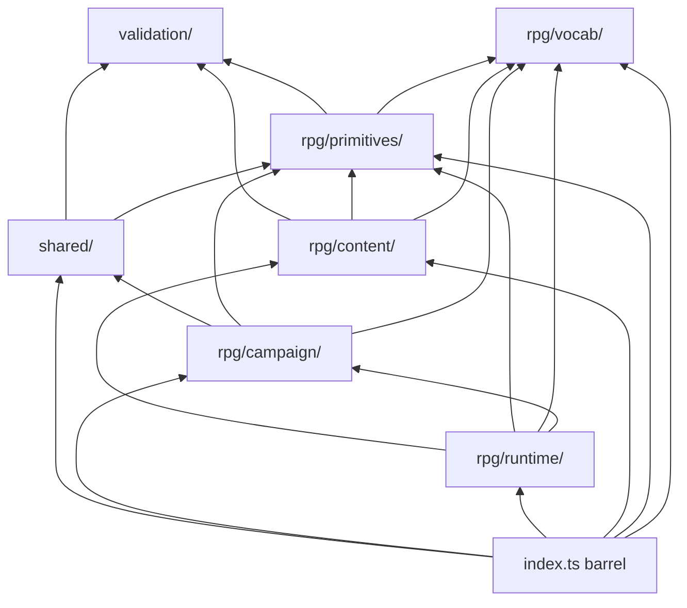

# Contracts package structure

`@rpg/contracts` is organized into layers under `src/`. The RPG game domain uses
five layers with **downward** imports (see dependency rules below). The root
barrel (`src/index.ts`) re-exports `shared/` plus everything under `rpg/` so
existing `import { … } from '@rpg/contracts'` usage stays unchanged.

**Dev Bench** (`dev-bench/`) is isolated for the local workbench product — import
`@rpg/contracts/dev-bench` explicitly. **Name generator** (`name-generator/`) is
isolated experimental naming contracts — import `@rpg/contracts/name-generator`
explicitly. **Public** (`public/`) is a scaffold for
future marketing/CMS contracts — import `@rpg/contracts/public` when added.

## Layer diagram

```text
packages/contracts/src/
  index.ts              # flat re-export of validation + shared + rpg (not dev-bench, not public)

  validation/           # defineMessage primitive + global validation message catalog
  shared/               # auth, user, roles, routes, errors, csrf, upload, assets
  rpg/
    vocab/              # closed-set game terms + open vocabulary set ids
    primitives/         # shared value types (levels, dice, units, ruleset id)
    content/            # catalog content types (species, weapons, classes, …)
      lib/              # envelope, grants, content-key, content-type-keys, …
      classes/          # class body, spellcasting, subclasses
        spellcasting/   # spellcasting schema + slot progression tables
    runtime/            # stored character sheets + builder runtime (not catalog content)
      character/        # sheet schema, provenance, proficiencies, inventory
      character-builder/ # builder draft, context, choice/step vocabulary
    campaign/           # campaign identity, rules, selection, patches/
  platform/             # backward-compat shim → shared + rpg/campaign
  public/               # scaffold (marketing/CMS — future)
  dev-bench/            # Dev Bench tickets, epics (isolated)
```



## Where to put new modules

| You are adding…                                         | Layer                   | Example path                                                                                                                 |
| ------------------------------------------------------- | ----------------------- | ---------------------------------------------------------------------------------------------------------------------------- |
| A shared validation message or message primitive        | `validation/`           | `validation/messages.ts` (see [validation-messages.md](validation-messages.md))                                              |
| A closed id set with labels (and optional SRD text)     | `rpg/vocab/`            | `rpg/vocab/sense.ts`, `rpg/vocab/weapon/property.ts`                                                                         |
| A reusable value type used across content types         | `rpg/primitives/`       | `rpg/primitives/dice.ts`, `rpg/primitives/units.ts`, `rpg/primitives/wealth.ts`                                              |
| A catalog content type or its DTOs/patches              | `rpg/content/`          | `rpg/content/species.ts`, `rpg/content/classes/class.ts`                                                                     |
| Shared content helpers (grants, envelope, keys)         | `rpg/content/lib/`      | `rpg/content/lib/grants.ts`                                                                                                  |
| Creature-like runtime primitives (PC, NPC, monster)     | `rpg/runtime/creature/` | `languages.ts`, `equipment.ts`, `spellcasting.ts` — see [runtime-resolution-boundaries.md](runtime-resolution-boundaries.md) |
| A stored character sheet or builder runtime contract    | `rpg/runtime/`          | `rpg/runtime/character/sheet.ts` — see [runtime-resolution-boundaries.md](runtime-resolution-boundaries.md)                  |
| Campaign identity, rules, membership, ruleset patches   | `rpg/campaign/`         | `rpg/campaign/campaign.ts`, `rpg/campaign/patches/`                                                                          |
| Campaign rule bodies (not catalog content types)        | `rpg/campaign/rules/`   | `rpg/campaign/rules/starting-wealth.ts`                                                                                      |
| Auth, session, upload, or API error shapes              | `shared/`               | `shared/auth.ts`, `shared/errors.ts`                                                                                         |
| Dev Bench ticket/epic schemas and input DTOs            | `dev-bench/`            | `dev-bench/ticket.ts`                                                                                                        |
| Name generator conventions, collections, and generation | `name-generator/`       | `name-generator/naming-convention.ts`                                                                                        |
| Public marketing or CMS schemas                         | `public/`               | (scaffold — add when needed)                                                                                                 |

Nested folders are fine when a domain splits cleanly (e.g. `rpg/content/classes/`
for spellcasting + class body, `rpg/vocab/weapon/` for weapon term maps).

Each layer has an `index.ts` barrel. Re-export new public symbols from that
barrel (the root barrel picks up `shared/` and `rpg/*` automatically).

## Dependency rules

Acyclic **downward** imports only — lower layers never import higher layers.

| Layer               | May import                                                                                      | Must not import                                                               |
| ------------------- | ----------------------------------------------------------------------------------------------- | ----------------------------------------------------------------------------- |
| `validation/`       | `validation/` only                                                                              | everything else                                                               |
| `shared/`           | `validation/`, `shared/`, `rpg/primitives/`                                                     | `rpg/vocab/`, `rpg/content/`, `rpg/runtime/`, `rpg/campaign/`                 |
| `rpg/vocab/`        | `validation/`, `rpg/vocab/`                                                                     | `rpg/primitives/`, `rpg/content/`, `rpg/runtime/`, `rpg/campaign/`, `shared/` |
| `rpg/primitives/`   | `validation/`, `rpg/vocab/`, `rpg/primitives/`                                                  | `rpg/content/`, `rpg/runtime/`, `rpg/campaign/`, `shared/`                    |
| `rpg/content/`      | `validation/`, `rpg/vocab/`, `rpg/primitives/`, `rpg/content/`                                  | `rpg/runtime/`, `rpg/campaign/`, `shared/`                                    |
| `rpg/runtime/`      | `validation/`, `rpg/vocab/`, `rpg/primitives/`, `rpg/content/`, `rpg/runtime/`, `rpg/campaign/` | `shared/`                                                                     |
| `rpg/campaign/`     | `validation/`, `rpg/vocab/`, `rpg/primitives/`, `rpg/campaign/`, `shared/`                      | `rpg/content/`, `rpg/runtime/`                                                |
| `public/`           | `public/` only                                                                                  | everything else                                                               |
| `dev-bench/`        | `dev-bench/` only                                                                               | everything else                                                               |
| `name-generator/`   | `validation/`, `vocab/`, `name-generator/` only                                                 | everything else                                                               |
| `index.ts` (barrel) | `validation/` + `shared/` + `rpg/*`                                                             | `dev-bench/`, `name-generator/`, `public/` (use subpath exports)              |

**Not enforced:** requiring `rpg/content/` to reach `rpg/vocab/` only via
`rpg/primitives/`. Content types legitimately import vocab schemas directly.

**Why `rpg/runtime/` may import `rpg/campaign/`:** the character builder runtime
consumes resolved campaign rules (`ResolvedCharacterCreationRules` extends the
resolved character-creation patch). Campaign never imports runtime, so the
graph stays acyclic.

Deep relative imports and barrel imports are both valid within the allowed graph.

## ESLint enforcement

Layer boundaries are enforced in [`eslint.config.js`](../eslint.config.js) via
`eslint-plugin-boundaries` (`boundaries/dependencies`, `default: 'disallow'`).

- **Production code** under `src/**/*.{ts,tsx}` is checked.
- **Co-located tests** (`*.test.ts`, `*.test.tsx`) are excluded — they may
  import the module under test freely.
- Violations fail `pnpm lint --filter @rpg/contracts` with a message pointing
  here.

## Subpath exports

Prefer the root import for app code unless you want an explicit layer boundary
in the import path:

| Import path                     | Resolves to                   | Typical use                           |
| ------------------------------- | ----------------------------- | ------------------------------------- |
| `@rpg/contracts`                | `src/index.ts`                | Default — all symbols, unchanged API  |
| `@rpg/contracts/shared`         | `src/shared/index.ts`         | Auth, user, roles, routes, errors     |
| `@rpg/contracts/vocab`          | `src/rpg/vocab/index.ts`      | Label/format helpers, vocabulary sets |
| `@rpg/contracts/primitives`     | `src/rpg/primitives/index.ts` | Dice, levels, ruleset id              |
| `@rpg/contracts/content`        | `src/rpg/content/index.ts`    | Content schemas and DTOs              |
| `@rpg/contracts/runtime`        | `src/rpg/runtime/index.ts`    | Character sheet runtime contracts     |
| `@rpg/contracts/rpg/campaign`   | `src/rpg/campaign/index.ts`   | Campaign + ruleset patches            |
| `@rpg/contracts/public`         | `src/public/index.ts`         | Public app only (scaffold)            |
| `@rpg/contracts/dev-bench`      | `src/dev-bench/index.ts`      | Dev Bench tickets, epics, inputs      |
| `@rpg/contracts/name-generator` | `src/name-generator/index.ts` | Naming conventions and collections    |

Legacy `./vocab`, `./content`, and `./primitives` export paths remain as
backward-compat aliases pointing at `rpg/*`. Prefer `./shared`, `./rpg/*`, and
explicit subpaths in new code.

Examples:

```ts
// Root barrel (recommended default)
import { speciesSchema, characterSchema } from '@rpg/contracts'

// Layer subpaths (optional — same symbols, explicit boundary)
import { getSenseLabel } from '@rpg/contracts/vocab'
import { speciesSchema } from '@rpg/contracts/content'
import { characterSchema } from '@rpg/contracts/runtime'
import { loginInputSchema } from '@rpg/contracts/shared'
import { campaignSchema } from '@rpg/contracts/rpg/campaign'
```

Subpath exports are defined in [`package.json`](../package.json) `exports`.

## Reference vocabulary (`GameTermEntry`)

Closed game-term maps live in `rpg/vocab/`. Shared shape in `rpg/vocab/types.ts`:

```ts
export type GameTermEntry = {
  readonly label: string
  readonly description: string
  readonly compactLabel?: string
  readonly sentence?: { readonly singular?: string; readonly plural?: string }
}

/** The concept a closed `*_ENTRIES` map classifies. */
export type VocabularyTerm = GameTermEntry
```

Every closed vocab module defines **two layers**:

1. **`*_TERM`** — the set concept (`label`, `description`, `sentence` for counted
   prose about the classification itself).
2. **`*_ENTRIES`** — per-value entries in the same `GameTermEntry` shape.

```ts
export const MAGIC_ITEM_RARITY_TERM = {
  label: 'Magic Item Rarity',
  description: 'A classification of a magic item’s relative power and availability.',
  sentence: { singular: 'magic item rarity', plural: 'magic item rarities' },
} as const satisfies GameTermEntry

export const MAGIC_ITEM_RARITY_ENTRIES = { common: { … }, … }
```

Pattern: `*_TERM` + `*_ENTRIES` map → derived id tuple → `z.enum` schema →
`get*Entry` / `get*Label` helpers. Open vocabulary sets define a `*_TERM` plus
`vocabularyOptionIdSchema` and catalog seeds; see
[docs/vocabulary.md](../../../docs/vocabulary.md).

Entity-specific fields stay on the content schema in `rpg/content/`, not in vocab maps.

Spell catalog content lives under `rpg/content/spell/` (`body.ts`, `levels.ts`,
`effects/`, `resolution/`); `rpg/content/spell.ts` is the facade re-export.
Class spellcasting (`rpg/content/classes/spellcasting/`) holds the class
`spellcasting` block schema and SRD slot tables (`slots.ts`).

Spell resolution (`rpg/content/spell/resolution/`) is an optional envelope on
`spellBodySchema` — selection mode, target/origin, method, effects, and outcome
applications. Vocab for resolution-specific closed sets lives alongside the module;
formatters return semantic preview strings. Like `effects`, `resolution` is on the read model
but omitted from `spellPersistedBodySchema` until API persistence lands.

Effect resolution documentation (shared framework + spell adapter):
[docs/effect-resolution/README.md](effect-resolution/README.md).

## Adding a schema

1. Pick the layer (table above).
2. Add a focused module with Zod schemas; derive types with `z.infer`.
3. Re-export from the layer's `index.ts` (root barrel picks it up automatically).
4. Add a co-located `*.test.ts` for validation behavior.

For catalog content types, follow [docs/content-types.md](../../../docs/content-types.md).
