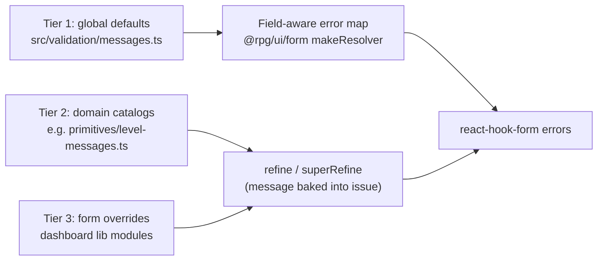

# Validation messages

User-facing validation copy is defined once in `@rpg/contracts` and formatted by
the frontend. Every message is a `defineMessage` definition — a stable id plus
an English formatter — so copy is testable, greppable, and ready for a future
locale catalog keyed by id.

## The three tiers



| Tier                | What                                                                                                                                                                                                  | Where                                                                                                                                                                | Example                                       |
| ------------------- | ----------------------------------------------------------------------------------------------------------------------------------------------------------------------------------------------------- | -------------------------------------------------------------------------------------------------------------------------------------------------------------------- | --------------------------------------------- |
| 1 — Global defaults | Boilerplate for required/min/max/integer/options/items. Schemas stay message-free (`z.number().int().min(1)`); the form layer's error map formats raw Zod issues with the field's configured `label`. | `src/validation/messages.ts` (`fieldValidationMessages`)                                                                                                             | `Level must be at least 1.`                   |
| 2 — Domain catalogs | Cross-field domain rules shared across schemas and apps. Messages are baked into `ctx.addIssue` / `.refine` at parse time.                                                                            | Co-located with the domain, e.g. `rpg/primitives/level-messages.ts` (`levelValidationMessages`), `rpg/content/xp-progression.ts` (`xpProgressionValidationMessages`) | `Level 5 is not covered by any tier.`         |
| 3 — Form overrides  | Rules specific to one form's shape. Same `defineMessage` primitive, defined next to the form schema in the app.                                                                                       | Dashboard `lib/` modules, e.g. `starting-wealth-form-fields.ts` (`startingWealthValidationMessages`)                                                                 | `Bonus gold rolls must use a multiplier (×).` |

Precedence is automatic: Zod only consults the tier-1 error map for issues that
have no message of their own, so tier-2/3 messages set via `.refine` /
`superRefine` always win, and unmapped paths fall back to Zod defaults.

## Defining messages

```ts
import { defineMessage } from '@rpg/contracts' // or '../validation/define-message' in-package

export const levelValidationMessages = {
  rangeGap: defineMessage<{ level: number }>(
    'validation.level.rangeGap',
    ({ level }) => `Level ${level} is not covered by any tier.`,
  ),
  invertedRange: defineMessage(
    'validation.level.invertedRange',
    () => 'Max level must be at least the min level.',
  ),
}

levelValidationMessages.rangeGap({ level: 5 }) // 'Level 5 is not covered by any tier.'
levelValidationMessages.rangeGap.id // 'validation.level.rangeGap'
```

Tests assert through the definition, never a literal:

```ts
expect(result.error.issues[0]?.message).toBe(levelValidationMessages.rangeGap({ level: 5 }))
```

## Naming conventions

| Thing          | Convention                                                                                          | Example                            |
| -------------- | --------------------------------------------------------------------------------------------------- | ---------------------------------- |
| Message id     | `validation.<scope>.<rule>` (camelCase segments)                                                    | `validation.level.rangeOverlap`    |
| Catalog const  | `<scope>ValidationMessages`                                                                         | `levelValidationMessages`          |
| File           | `<domain>-messages.ts` next to the domain module; small domains may keep an in-file section instead | `rpg/primitives/level-messages.ts` |
| Global catalog | `fieldValidationMessages` in `src/validation/messages.ts`                                           | —                                  |

## Copy style

- Full sentences, sentence case, trailing period.
- Lead with the field label or the subject: `{label} must be at least {min}.`
- Choice fields use "Choose …": `Choose a rarity.` / `Choose a valid rarity.`
- List fields use "Add …": `Add at least one wealth tier.`
- Interpolate concrete values (levels, caps, labels) rather than restating the rule
  abstractly.
- **Stand alone outside tab/panel context** — messages must make sense on a tab
  trigger or summary line without the surrounding panel (so TabbedForm indicators
  can reuse them later without rewrites).
- Label helpers for interpolation live in `src/validation/messages.ts`:
  `midSentenceLabel` (lowercase unless initialism), `withArticle` (`a`/`an`),
  `singularizeLabel` (`Wealth tiers` → `Wealth tier`).

## Tier 1: how the error map picks a message

The form layer (`makeFieldErrorMap` in `@rpg/ui/form`) walks the form's
`fields` config into a path registry (array indices normalized to `*`,
composite subpaths resolved to the owning field) and formats by issue code and
field category:

| Issue                                   | Field category          | Message                                                            |
| --------------------------------------- | ----------------------- | ------------------------------------------------------------------ |
| `invalid_type` (missing)                | text / boolean / number | `{label} is required.`                                             |
| `invalid_type` (missing)                | choice                  | `Choose {a label}.`                                                |
| `invalid_type` expected `int`           | number                  | `{label} must be a whole number.`                                  |
| `too_small` string min 1                | text                    | `{label} is required.`                                             |
| `too_small` string min > 1              | text                    | `{label} must be at least {min} characters.`                       |
| `too_small` / `too_big` number          | number                  | `{label} must be at least {min}.` / `{label} cannot exceed {max}.` |
| `too_small` array                       | multi / array container | `Add at least one {item label}.` (label singularized)              |
| `invalid_value` / `invalid_union` empty | choice / multi          | `Choose {a label}.`                                                |
| `invalid_value` / `invalid_union` other | choice / multi          | `Choose a valid {label}.`                                          |
| `invalid_value` other                   | text / number / boolean | `{label} has an invalid value.`                                    |
| `invalid_union`                         | non-choice              | `Complete the required fields for this option.`                    |
| `invalid_format` `email`                | any                     | `Enter a valid email address.`                                     |
| `invalid_format` `url`                  | any                     | `Enter a valid URL.`                                               |
| `invalid_format` `regex` on `slug`      | text                    | `Use lowercase letters, numbers, and hyphens only.`                |
| `invalid_format` other                  | any                     | `{label} has an invalid format.`                                   |
| `too_small` / `too_big` other origins   | any                     | `{label} is too small.` / `{label} is too large.`                  |
| `too_small` / `too_big` array `exact`   | array / multi           | `Add exactly {n} {items label}.`                                   |
| registered path, unhandled code         | any                     | `{label} is invalid.` (catch-all safety net)                       |

Unregistered paths still return `undefined` → Zod's default message. Categories cover
every `FieldType` (chips/combobox split on `multiple`, `chooseFromChips`
registers both the chip path and the count path, `levelRange` registers the
min/max names, `editableGrid` registers each column key, `diceFormula` registers
count/faces/modifier/currency subpaths, `slot` fields register by name, arrays
register their `legend` with `itemLabel` derived from `itemHeader` when present).

## Adding a new domain catalog

1. Create `<domain>-messages.ts` beside the schema module (tier 2) or a catalog
   const in the form's `lib/` module (tier 3).
2. Define messages with `defineMessage` using `validation.<scope>.<rule>` ids.
3. Reference the catalog in `.refine` / `superRefine` — never inline literals.
4. Assert messages in tests through the catalog.
5. Re-export from the layer barrel (contracts) so apps share the copy.

## Verification

Form tests use `@rpg/ui/form/test-utils` (`assertRegistryCoverage`,
`assertFieldPathsRegistered`, `assertInvalidSubmitUsesRefinedMessages`,
`expectNoDefaultZodMessages`) so live forms never surface raw Zod copy. See
[packages/ui/docs/forms.md](../../ui/docs/forms.md) and
[apps/dashboard/docs/form-lib-conventions.md](../../../apps/dashboard/docs/form-lib-conventions.md).

## Deferred (not yet cataloged / out of form scope)

- **TabbedForm shell** — inactive-tab error indicators (copy is written to stand
  alone outside tab context for future shell work).
- **Non-form schemas** — runtime character, campaign patches, multiclassing
  helper, dev-bench, API env.
- **Equipment per-kind invalid-submit sweep** — field-path registration is
  covered per kind; full-schema invalid-submit is blocked by the unified
  multi-kind schema shape (variant copy verified in equipment `*-form-values`
  tests).
- **Future seams** — API `{ id, params }` structured issues, locale registry,
  compact `summaryMessage` variants per id.
