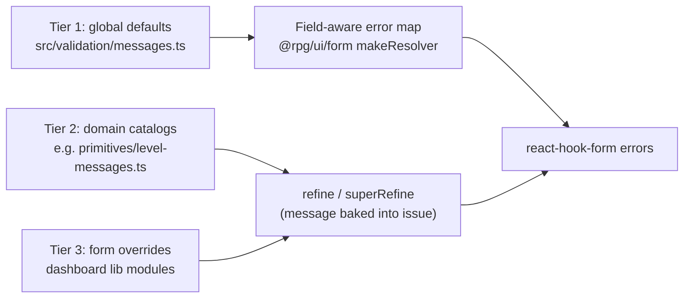

# Validation messages

User-facing validation copy is defined once in `@rpg/contracts` and formatted by
the frontend. Every message is a `defineMessage` definition — a stable id plus
an English formatter — so copy is testable, greppable, and ready for a future
locale catalog keyed by id.

## The three tiers



| Tier                | What                                                                                                                                                                                                  | Where                                                                                                                                                                | Example                                       |
| ------------------- | ----------------------------------------------------------------------------------------------------------------------------------------------------------------------------------------------------- | -------------------------------------------------------------------------------------------------------------------------------------------------------------------- | --------------------------------------------- |
| 1 — Global defaults | Boilerplate for required/min/max/integer/options/items. Schemas stay message-free (`z.number().int().min(1)`); the form layer's error map formats raw Zod issues with the field's configured `label`. | `src/validation/messages.ts` (`fieldValidationMessages`)                                                                                                             | `Level must be at least 1.`                   |
| 2 — Domain catalogs | Cross-field domain rules shared across schemas and apps. Messages are baked into `ctx.addIssue` / `.refine` at parse time.                                                                            | Co-located with the domain, e.g. `rpg/primitives/level-messages.ts` (`levelValidationMessages`), `rpg/content/xp-progression.ts` (`xpProgressionValidationMessages`) | `Level 5 is not covered by any tier.`         |
| 3 — Form overrides  | Rules specific to one form's shape. Same `defineMessage` primitive, defined next to the form schema in the app.                                                                                       | Dashboard `lib/` modules, e.g. `starting-wealth-form-fields.ts` (`startingWealthValidationMessages`)                                                                 | `Bonus gold rolls must use a multiplier (×).` |

Precedence is automatic: Zod only consults the tier-1 error map for issues that
have no message of their own, so tier-2/3 messages set via `.refine` /
`superRefine` always win, and unmapped paths fall back to Zod defaults.

## Defining messages

```ts
import { defineMessage } from '@rpg/contracts' // or '../validation/define-message' in-package

export const levelValidationMessages = {
  rangeGap: defineMessage<{ level: number }>(
    'validation.level.rangeGap',
    ({ level }) => `Level ${level} is not covered by any tier.`,
  ),
  invertedRange: defineMessage(
    'validation.level.invertedRange',
    () => 'Max level must be at least the min level.',
  ),
}

levelValidationMessages.rangeGap({ level: 5 }) // 'Level 5 is not covered by any tier.'
levelValidationMessages.rangeGap.id // 'validation.level.rangeGap'
```

Tests assert through the definition, never a literal:

```ts
expect(result.error.issues[0]?.message).toBe(levelValidationMessages.rangeGap({ level: 5 }))
```

## Naming conventions

| Thing          | Convention                                                                                          | Example                            |
| -------------- | --------------------------------------------------------------------------------------------------- | ---------------------------------- |
| Message id     | `validation.<scope>.<rule>` (camelCase segments)                                                    | `validation.level.rangeOverlap`    |
| Catalog const  | `<scope>ValidationMessages`                                                                         | `levelValidationMessages`          |
| File           | `<domain>-messages.ts` next to the domain module; small domains may keep an in-file section instead | `rpg/primitives/level-messages.ts` |
| Global catalog | `fieldValidationMessages` in `src/validation/messages.ts`                                           | —                                  |

| Catalog const                                    | Scope prefix                                | Owns                                                                 |
| ------------------------------------------------ | ------------------------------------------- | -------------------------------------------------------------------- |
| `levelValidationMessages`                        | `validation.level.*`                        | Level bounds, tables, campaign max (`overCampaignMax`)               |
| `characterValidationMessages`                    | `validation.character.*`                    | Valid character data (duplicate class, proficiency targets, sources) |
| `featValidationMessages`                         | `validation.feat.*`                         | Feat persisted business rules                                        |
| `requirementEditorValidationMessages`            | `validation.requirementEditor.*`            | Prerequisite builder UI state (dashboard)                            |
| `speciesCharacterCreationValidationMessages`     | `validation.speciesCharacterCreation.*`     | Persisted species creation domain                                    |
| `speciesCharacterCreationFormValidationMessages` | `validation.speciesCharacterCreationForm.*` | Species creation form-only rules (dashboard)                         |

Future `validation.requirement.*` holds persisted requirement-expression rules when
`requirement-expression.ts` gains `superRefine` validation; editor-only rules stay in
`validation.requirementEditor.*`.

### Character validation catalogs

**Base catalog (tier 2):** `characterValidationMessages` in
`rpg/runtime/character/character-messages.ts` — rules describing valid character data,
not a specific UI surface. First consumers live under `runtime/character/`, but ids use
`validation.character.*` so builder, sheet, level-up, and import flows can reuse the copy.

**Dependency direction:** surface-specific catalogs may import and reuse
`characterValidationMessages`; the base catalog must not depend on builder, sheet, or
level-up concepts.

**Future surface catalogs** (add only when those UI flows ship):

| Catalog const                          | Scope prefix                      | Owns                                                                  |
| -------------------------------------- | --------------------------------- | --------------------------------------------------------------------- |
| `characterBuilderValidationMessages`   | `validation.characterBuilder.*`   | Builder workflow copy (incomplete steps, pending draft choices)       |
| `characterSheetFormValidationMessages` | `validation.characterSheetForm.*` | Sheet editor workflow copy (unsaved edits, sheet-specific sequencing) |
| `characterLevelUpValidationMessages`   | `validation.characterLevelUp.*`   | Level-up wizard workflow copy (sequencing, pending choices)           |

Species level-limit forms use `levelValidationMessages.overCampaignMax` for campaign-cap
violations; the form-only “required when limit enabled” rule stays in
`speciesCharacterCreationFormValidationMessages` (tier 3).

## Copy style

- Full sentences, sentence case, trailing period.
- Lead with the field label or the subject: `{label} must be at least {min}.`
- Choice fields use "Choose …": `Choose a rarity.` / `Choose a valid rarity.`
- List fields use "Add …": `Add at least one wealth tier.`
- Interpolate concrete values (levels, caps, labels) rather than restating the rule
  abstractly.
- **Stand alone outside tab/panel context** — messages must make sense on a tab
  trigger or summary line without the surrounding panel (so TabbedForm indicators
  can reuse them later without rewrites).
- Label helpers for interpolation live in `src/validation/messages.ts`:
  `midSentenceLabel` (lowercase unless initialism), `withArticle` (`a`/`an`),
  `singularizeLabel` (`Wealth tiers` → `Wealth tier`).

## Copy helpers

Small sentence-shape helpers live beside the label helpers in
`src/validation/messages.ts`. They format copy only — message ids and domain
ownership stay in each catalog's `defineMessage` definitions.

| Helper                                            | Shape                                        | Param conventions                                                                    |
| ------------------------------------------------- | -------------------------------------------- | ------------------------------------------------------------------------------------ |
| `requiredWhenCopy(subjectLabel, conditionClause)` | `{subject} is required when {clause}.`       | `conditionClause` is lowercase, no leading "when", no trailing punctuation           |
| `betweenCopy(subjectLabel, min, max)`             | `{subject} must be between {min} and {max}.` | Prefer concrete numbers when known; strings are for bounds not fixed at message time |

**Decision standard:** domain-specific message ids + small copy helpers first;
extract a primitive/shared catalog only after the same rule appears in a second
domain with identical copy. Do not contort copy to fit a helper — if "for",
"unless", or action-oriented wording reads better (`Choose a source, or set the
source kind to manual.`), keep the message domain-specific.

**Non-recommendations** (from BENCH-067 analysis — one helper per shape, no
shared primitive ids):

| Shape                                | Why not                                                                                                                          |
| ------------------------------------ | -------------------------------------------------------------------------------------------------------------------------------- |
| Exclusivity (`Choose either A or B`) | Only character proficiencies today; keep `exclusiveEitherCopy` private in `character-messages.ts` until a second domain needs it |
| Duplicate / already used             | Tier-1 `duplicateItem` covers the common case; domain rules need specific subjects                                               |
| At-least-one / add-one               | Tier-1 `minItems` and action-led "Add …" copy fit list fields better                                                             |
| Only-applies-to / unless             | Condition clauses vary too much (`for`, `when`, `unless`) for a single template                                                  |

Example adoption (ids unchanged):

```ts
import { betweenCopy, requiredWhenCopy } from '@rpg/contracts'

materialDescriptionRequired: defineMessage(
  'validation.spell.materialDescriptionRequired',
  () => requiredWhenCopy('Material description', 'the material component is selected'),
),

outOfBounds: defineMessage<{ maxLevel: number }>(
  'validation.level.outOfBounds',
  ({ maxLevel }) => betweenCopy('Level', 1, maxLevel),
),
```

Intentionally **not** adopting helpers: `selectionSourceIdRequired` (action copy),
`extendedTierNameRequired` / `extendedMaxLevelRequired` ("for", not "when"),
`overCampaignMax` (shared domain concept with its own id and summary variant).

## Tier 1: how the error map picks a message

The form layer (`makeFieldErrorMap` in `@rpg/ui/form`) walks the form's
`fields` config into a path registry (array indices normalized to `*`,
composite subpaths resolved to the owning field) and formats by issue code and
field category:

| Issue                                   | Field category          | Message                                                            |
| --------------------------------------- | ----------------------- | ------------------------------------------------------------------ |
| `invalid_type` (missing)                | text / boolean / number | `{label} is required.`                                             |
| `invalid_type` (missing)                | choice                  | `Choose {a label}.`                                                |
| `invalid_type` expected `int`           | number                  | `{label} must be a whole number.`                                  |
| `too_small` string min 1                | text                    | `{label} is required.`                                             |
| `too_small` string min > 1              | text                    | `{label} must be at least {min} characters.`                       |
| `too_small` / `too_big` number          | number                  | `{label} must be at least {min}.` / `{label} cannot exceed {max}.` |
| `too_small` array                       | multi / array container | `Add at least one {item label}.` (label singularized)              |
| `invalid_value` / `invalid_union` empty | choice / multi          | `Choose {a label}.`                                                |
| `invalid_value` / `invalid_union` other | choice / multi          | `Choose a valid {label}.`                                          |
| `invalid_value` other                   | text / number / boolean | `{label} has an invalid value.`                                    |
| `invalid_union`                         | non-choice              | `Complete the required fields for this option.`                    |
| `invalid_format` `email`                | any                     | `Enter a valid email address.`                                     |
| `invalid_format` `url`                  | any                     | `Enter a valid URL.`                                               |
| `invalid_format` `regex` on `slug`      | text                    | `Use lowercase letters, numbers, and hyphens only.`                |
| `invalid_format` other                  | any                     | `{label} has an invalid format.`                                   |
| `too_small` / `too_big` other origins   | any                     | `{label} is too small.` / `{label} is too large.`                  |
| `too_small` / `too_big` array `exact`   | array / multi           | `Add exactly {n} {items label}.`                                   |
| registered path, unhandled code         | any                     | `{label} is invalid.` (catch-all safety net)                       |

Unregistered paths still return `undefined` → Zod's default message. Categories cover
every `FieldType` (chips/combobox split on `multiple`, `chooseFromChips`
registers both the chip path and the count path, `levelRange` registers the
min/max names, `editableGrid` registers each column key, `diceFormula` registers
count/faces/modifier/currency subpaths, `slot` fields register by name, arrays
register their `legend` with `itemLabel` derived from `itemHeader` when present).

## Adding a new domain catalog

1. Create `<domain>-messages.ts` beside the schema module (tier 2) or a catalog
   const in the form's `lib/` module (tier 3).
2. Define messages with `defineMessage` using `validation.<scope>.<rule>` ids.
3. Reference the catalog in `.refine` / `superRefine` — never inline literals.
4. Assert messages in tests through the catalog.
5. Re-export from the layer barrel (contracts) so apps share the copy.

## Verification

Form tests use `@rpg/ui/form/test-utils` (`assertRegistryCoverage`,
`assertFieldPathsRegistered`, `assertInvalidSubmitUsesRefinedMessages`,
`expectNoDefaultZodMessages`) so live forms never surface raw Zod copy. See
[packages/ui/docs/forms.md](../../ui/docs/forms.md) and
[apps/dashboard/docs/form-lib-conventions.md](../../../apps/dashboard/docs/form-lib-conventions.md).

## Deferred gap list

Items intentionally outside the live-form verification sweep (Phase 4). Catalog
them before the UI that surfaces the errors ships.

### TabbedForm shell UX

**Status:** implemented in `@rpg/ui` `TabbedForm` — tab count badges, auto-switch/focus on
failed submit, and footer summary with Review actions. Schema/message modules for the four
TabbedForm surfaces (campaign settings, species, class, spell) remain verified separately.

Shell behaviour is documented in
[packages/ui/docs/forms.md](../../ui/docs/forms.md#tabbedform). **Copy rule for
authors:** messages in TabbedForm-backed schemas must stand alone outside their
tab/panel context (see [Copy style](#copy-style)) so they can be reused on tab
triggers and in the footer summary without rewrites.

### Non-form schemas

Schemas that validate API payloads, runtime state, or internal tooling — not
bound to a `<Form>` / `WizardStepForm` / `TabbedForm` field config. Most issues
are developer- or server-facing; migrate to `defineMessage` catalogs when a
user-facing surface appears.

| Module                                           | Inline / hardcoded copy                                                      | When to catalog                      |
| ------------------------------------------------ | ---------------------------------------------------------------------------- | ------------------------------------ |
| `rpg/content/lib/multiclassing-validation.ts`    | Six eligibility strings (ability floor, species/class caps, campaign toggle) | Multiclass step in character builder |
| `dev-bench/code-ref.ts`                          | `lineEnd` ≥ `lineStart`                                                      | Dev Bench ticket editor              |
| `dev-bench/hex-color.ts`                         | Hex format (`#RRGGBB`)                                                       | Dev Bench epic badge color           |
| `apps/api/src/env.ts`                            | `JWT_SECRET` min length (startup)                                            | Never — server config only           |
| `apps/api/src/features/dev-bench/bench-query.ts` | `bucket` / `status` mutual exclusion                                         | Dev Bench query validation (API)     |

### Equipment unified schema

**Status:** closed (BENCH-074) — kind-scoped form schemas
(`resolveEquipmentFormSchema`) match each family route's rendered fields.
`content-form-validation.test.ts` runs `assertRegistryCoverage` and
`assertInvalidSubmitUsesRefinedMessages` per `EQUIPMENT_KIND`. The unscoped hub
still uses flat `equipmentFormSchema` (no submit). Per-family `build*Input` /
`createEquipmentInputSchema.parse()` tests remain the submit-time domain contract.

### Future seams

Planned extensions to the message architecture — not started:

| Seam                        | Purpose                                                                                                          |
| --------------------------- | ---------------------------------------------------------------------------------------------------------------- |
| API `{ id, params }` issues | Structured validation errors from the API that map to catalog ids + interpolation params (same ids as tier 2/3). |
| Locale registry             | Key `defineMessage` ids by locale; `formatFieldMessage` becomes locale-aware.                                    |
| `summaryMessage` variants   | Compact per-id formatters for tab triggers and inline indicators (full sentence remains the default).            |
